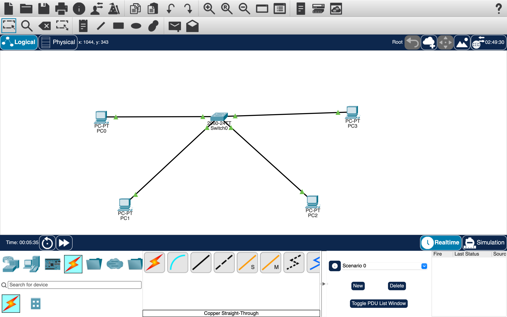
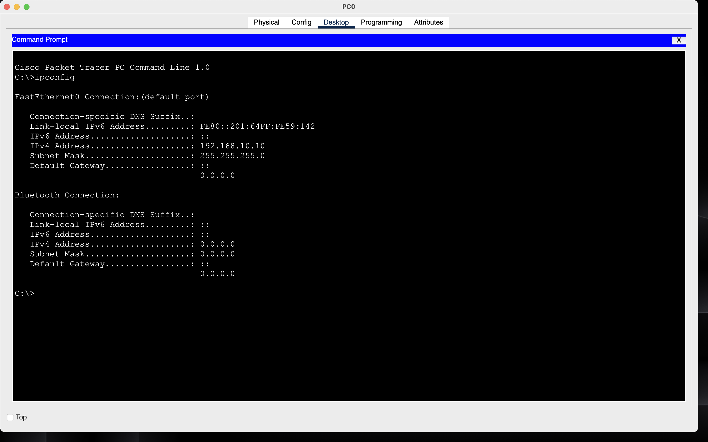
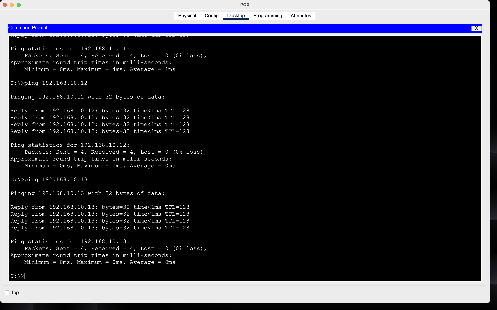
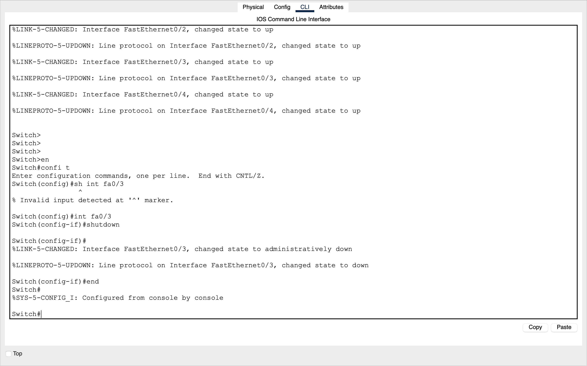
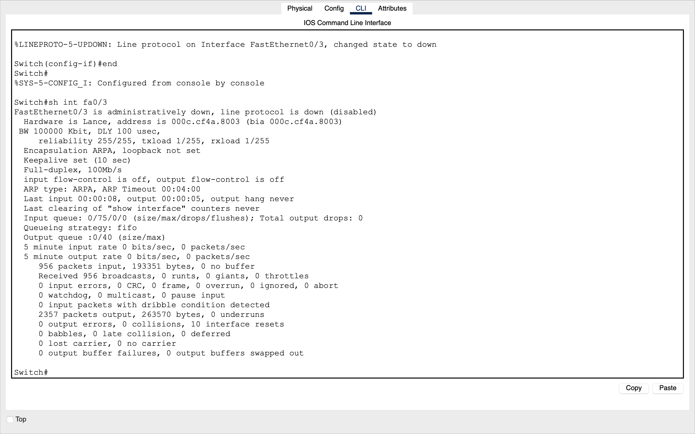
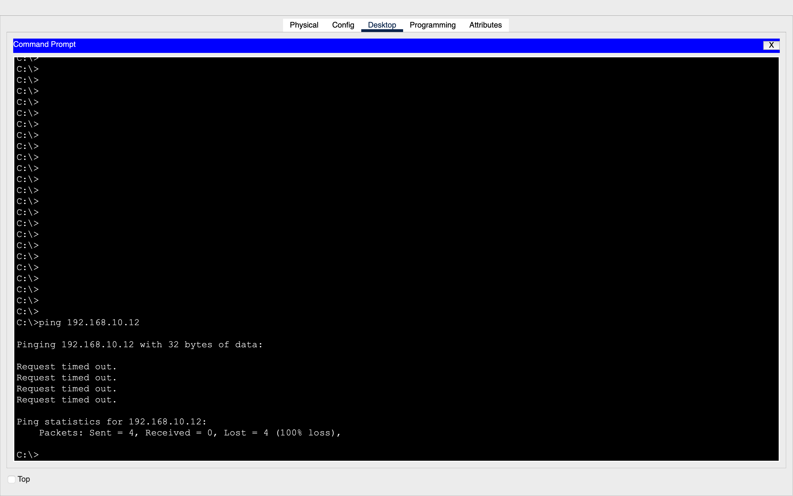
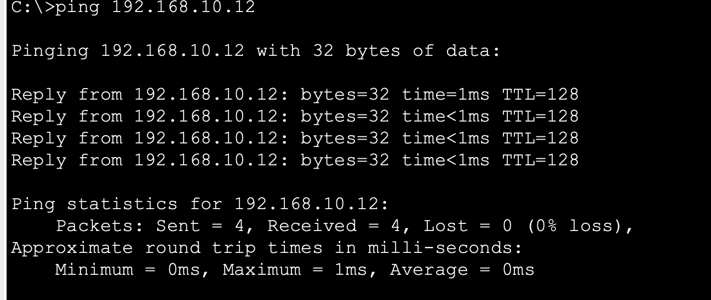
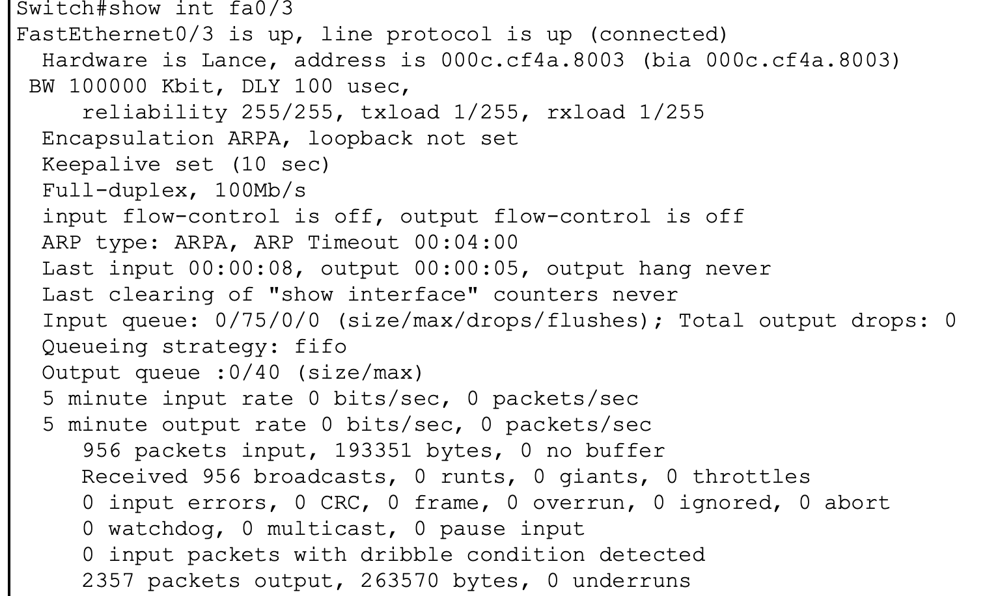

# Basic LAN — Cisco Packet Tracer

## Objective

Build and verify a basic switched LAN in Cisco Packet Tracer.

This lab covers:

- Ethernet connectivity between end devices and a switch
- IPv4 addressing within one LAN
- Ping-based connectivity verification
- Cisco switch interface states
- `shutdown` and `no shutdown`
- Difference between `up/up` and `administratively down/down`
- Verification with `show interface`

## Topology

```text
PC0 ── Fa0/1
PC1 ── Fa0/2
PC2 ── Fa0/3
PC3 ── Fa0/4
          │
        Switch
```




Known address verified during the exercise:

| Device | IPv4 address |
|---|---|
| PC0 | 192.168.10.10/24 |
| PC2 | 192.168.10.12/24 |

PC1 and PC3 addresses should be taken directly from the Packet Tracer file rather than inferred.

Sample output of PC0:

```text
ipconfig

Windows IP Configuration

Ethernet adapter Ethernet:

   Connection-specific DNS Suffix  . :
   Link-local IPv6 Address . . . . . : fe80::250:56ff:fe8d:7788%11
   IPv4 Address. . . . . . . . . . . : 192.168.10.10
   Subnet Mask . . . . . . . . . . . : 255.255.255.0
   Default Gateway . . . . . . . . . : 0.0.0.0
```




## 1. Initial Connectivity

PC0 successfully pinged `192.168.10.11`, `192.168.10.12`, `192.168.10.13`.




```text
Packets: Sent = 4, Received = 4, Lost = 0 (0% loss)
Minimum = 0ms, Maximum = 1ms, Average = 0ms
```


This verified end-to-end connectivity between the two hosts through the switch.

## 2. Disable Fa0/3

Commands used:

```text
enable
configure terminal
interface fa0/3
shutdown
end
```
NB: This interface was administratively disabled.


The `shutdown` command disabled the interface, preventing any traffic from passing through it.


Verification:

```text
show interface fa0/3
```

Observed:

```text
FastEthernet0/3 is administratively down, line protocol is down (disabled)
```




`administratively down` means the interface was intentionally disabled by configuration.

PC0 then attempted to reach `192.168.10.12`:

```text
Packets: Sent = 4, Received = 0, Lost = 4 (100% loss)
```



The failed ping confirms that disabling Fa0/3 interrupted the Ethernet path to the destination.

## 3. Restore Fa0/3

Commands used:

```text
enable
configure terminal
interface fa0/3
no shutdown
end
```


The switch reported:

```text
%LINK-5-CHANGED: Interface FastEthernet0/3, changed state to up
%LINEPROTO-5-UPDOWN: Line protocol on Interface FastEthernet0/3, changed state to up
```

Verification:

```text
show interface fa0/3
```

Observed:

```text
FastEthernet0/3 is up, line protocol is up (connected)
```


PC0 then successfully pinged `192.168.10.12` again:




```text
Packets: Sent = 4, Received = 4, Lost = 0 (0% loss)
Minimum = 0ms, Maximum = 1ms, Average = 0ms
```

## 4. Interface State Reference

| State | Meaning | Typical cause |
|---|---|---|
| `up/up` | Physical link and line protocol are operational | Normal working connection |
| `administratively down/down` | Interface has been disabled by configuration | `shutdown` |
| `down/down` | Interface is not administratively disabled but the link is not operational | Cable, remote device, or physical/link problem |

## 5. Key Commands

```text
show interface fa0/3
```
Displays detailed information about Fa0/3.


```text
interface fa0/3
shutdown
```
Administratively disables Fa0/3.

```text
interface fa0/3
no shutdown
```
Removes the administrative shutdown and enables Fa0/3.

## 6. Verification Method

The lab uses two forms of verification:

1. **Device-side verification** — `show interface fa0/3`
2. **End-to-end verification** — `ping 192.168.10.12`

A configuration command alone is not considered proof that connectivity works.

## 7. Observed Sequence

```text
Working LAN
    │
    ├── Fa0/3 = up/up
    │
    └── Ping = 0% loss
    │
    ▼
shutdown
    │
    ├── Fa0/3 = administratively down/down
    │
    └── Ping = 100% loss
    │
    ▼
no shutdown
    │
    ├── LINK = up
    ├── LINEPROTO = up
    ├── Fa0/3 = up/up
    │
    └── Ping = 0% loss
```

## 8. Completion Criteria

- [x] End devices connected to switch ports
- [x] LAN connectivity verified
- [x] PC0 successfully reached `192.168.10.12`
- [x] Fa0/3 administratively shut down
- [x] Ping failure verified with 100% loss
- [x] Fa0/3 restored with `no shutdown`
- [x] LINK and LINEPROTO recovery messages observed
- [x] Ping restored with 0% loss
