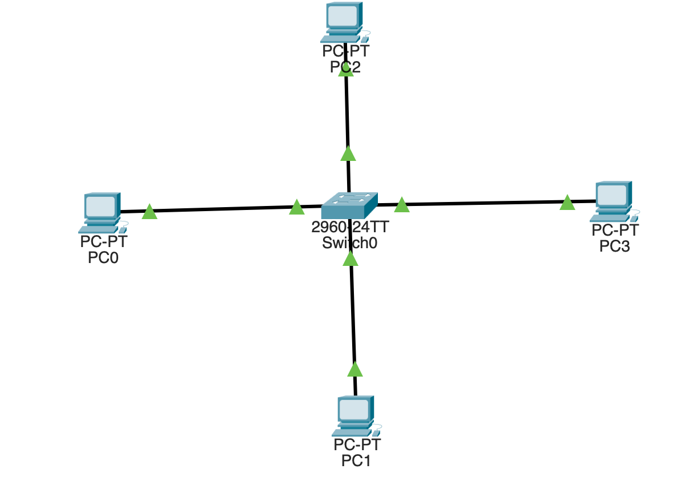
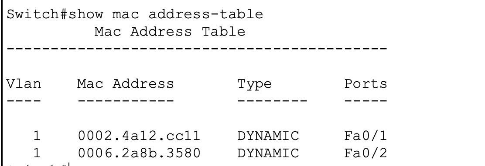
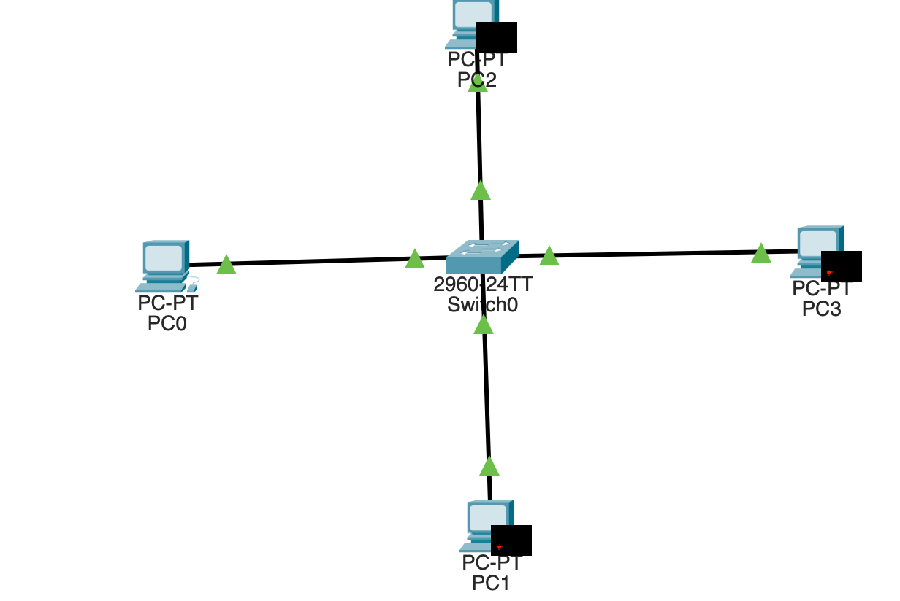
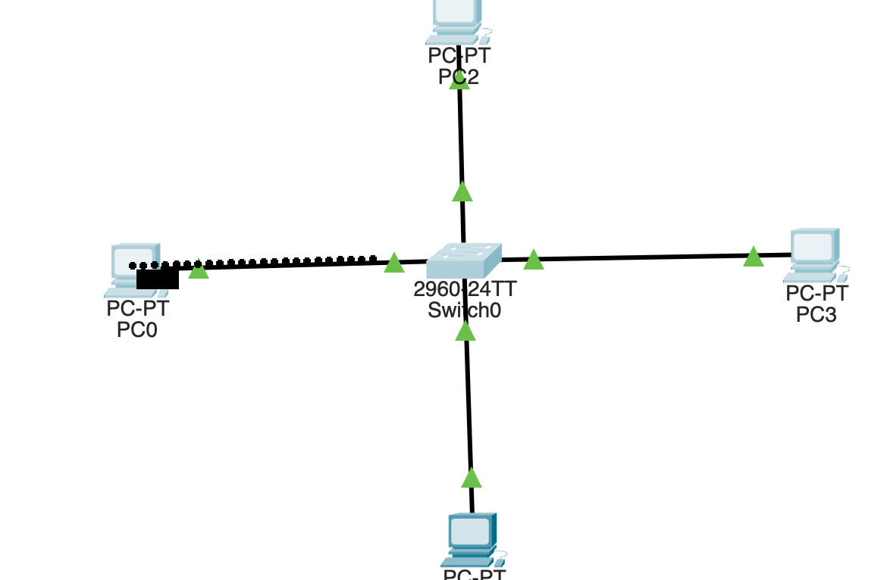
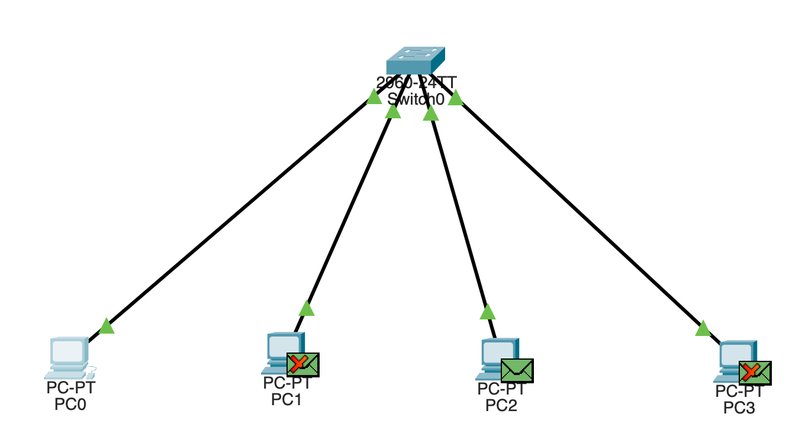
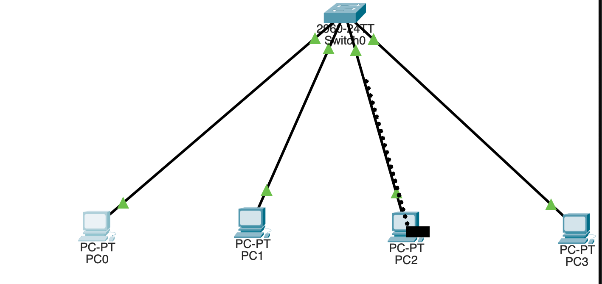

# MAC Address Learning and Switch Forwarding

## Objective

Understanding how a layer 2 switch learns MAC addresses and associates them with switch ports.

The lab demonstrates: 
- MAC address learning process
- MAC address table entries
- Frame forwarding
- Unknown unicast flooding
- Broadcast forwarding


## Topology



## Addressing 

| Device | IP Address | Switch Port |
|--------|------------|-------------|
| PC0 | 192.168.10.10/24 | Fa0/1 |
| PC1 | 192.168.10.11/24 | Fa0/2 |
| PC2 | 192.168.10.12/24 | Fa0/3 |
| PC3 | 192.168.10.13/24 | Fa0/4 |


Note: no default gateway is configured because all devices are in the same subnet.


## MAC Address Learning

The switch initially has an empty MAC address table.

After PC0 communicated with PC2, the switch learned the source MAC addresses associated with the interfaces receiving the frames.

The entries were learned dynamically.

Run:

```text
show mac address-table dynamic
```




## ARP Broadcast and Flooding

When PC0 initiated communication with PC2, PC0 first generated an ARP (Address Resolution Protocol) request to resolve PC2's IP address to a MAC address.

The ARP request was a layer 2 broadcast.

The switch received the broadcast on Fa0/1 and flooded it through the other active interfaces/ports in VLAN 1.





## Frame Forwarding
The ARP reply from PC2 was forwarded only toward PC0.
Unlike the ARP request, which was a broadcast and was flooded through the VLAN, the ARP reply forwarded through the specific interface/port associated with PC0's learned MAC address.

```text
PC2 -> Switch -> Fa0/1 -> PC0
```



## Unknown-Unicast Flooding

When PC0 generated the first ICMP frame toward PC2, the switch did not yet have the destination MAC address in its MAC address table.

The switch therefore flooded the frame through the other active ports in VLAN 1.




## Known-Unicast Forwarding


After the switch learned PC2's MAC address, subsequent frames destined for PC2 were forwarded only through the interface associated with PC2's MAC address.


## Verification

The following commands were used during the lab:
```text
show mac address-table
show mac address-table dynamic
show interfaces status 
```
