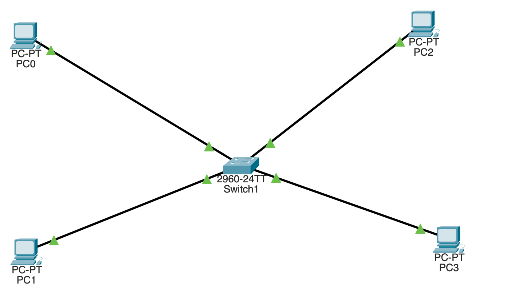

# VLAN Segmentation and Layer 2 Broadcast Domains

## Objective

Configure and verify VLAN-based Layer 2 segmentation on an enterprise access switch.

This lab demonstrates:

- VLAN creation
- Access-port assignment
- Same-VLAN Layer 2 connectivity
- Inter-VLAN isolation
- ARP broadcast isolation
- VLAN-aware MAC address learning
- Verification of switchport state and VLAN membership

The lab intentionally does not configure inter-VLAN routing. This allows the Layer 2 behavior of VLANs to be observed before introducing Layer 3 routing.

---

## Enterprise Scenario

A small enterprise network requires logical separation between two departments:

- **USERS** — employee endpoints
- **FINANCE** — finance department endpoints

Both departments connect to the same physical switch but must operate as separate Layer 2 broadcast domains.

The design uses:

| VLAN | Name | Purpose |
|---:|---|---|
| 10 | USERS | Employee endpoints |
| 20 | FINANCE | Finance endpoints |

---

## Topology



SW1 provides Layer 2 connectivity for four endpoint devices.

```text
                     SW1
              Cisco 2960 Switch
                 /    |    \
                /     |     \
              PC0    PC1    PC2    PC3
               |      |      |      |
             Fa0/1  Fa0/2  Fa0/3  Fa0/4
               |      |      |      |
             VLAN 10        VLAN 20
              USERS          FINANCE
