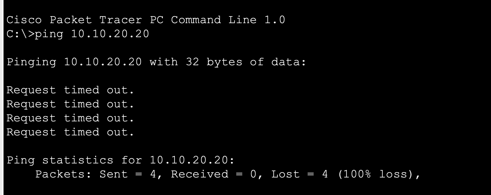
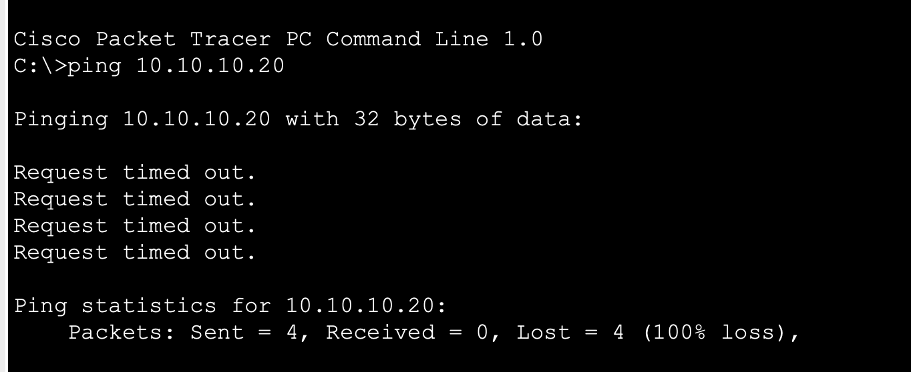
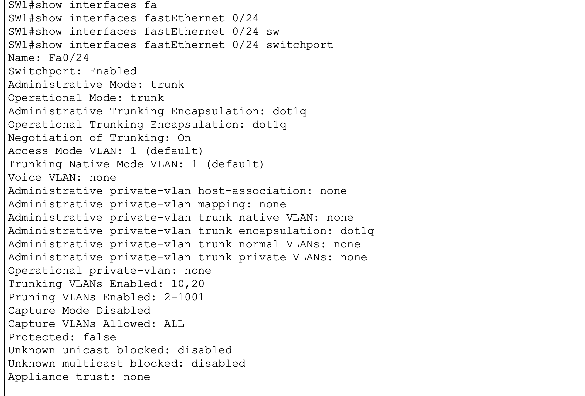
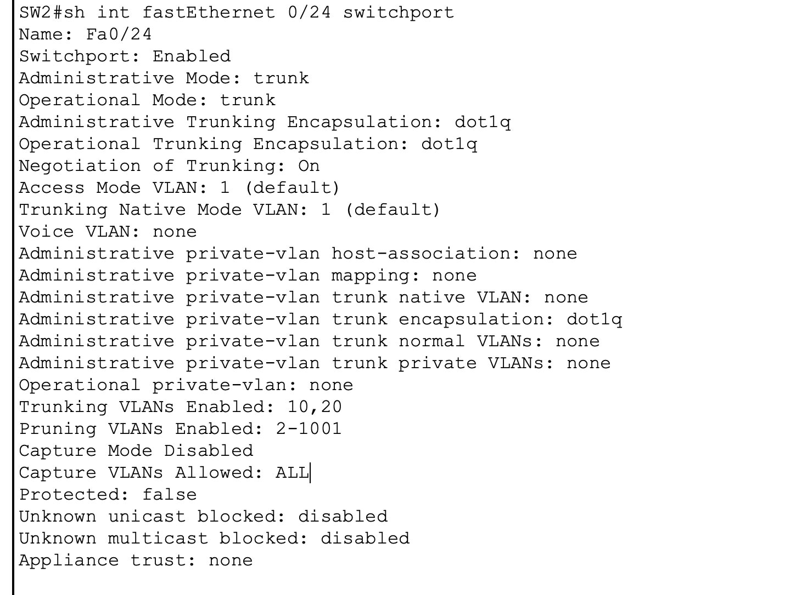
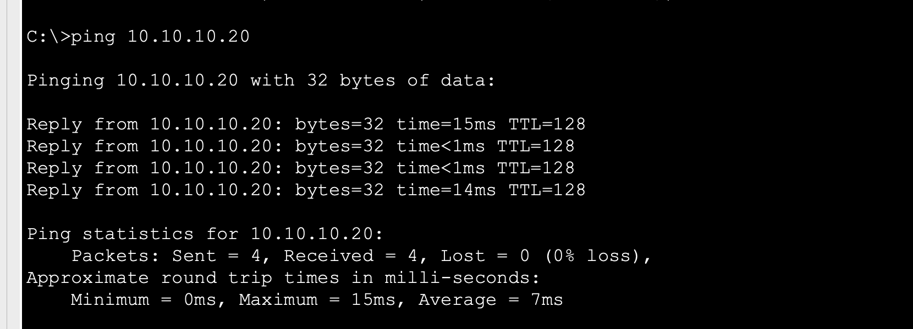
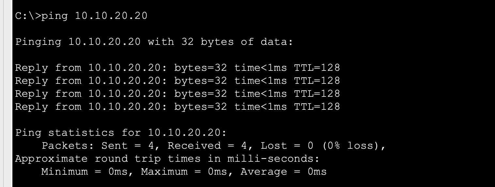
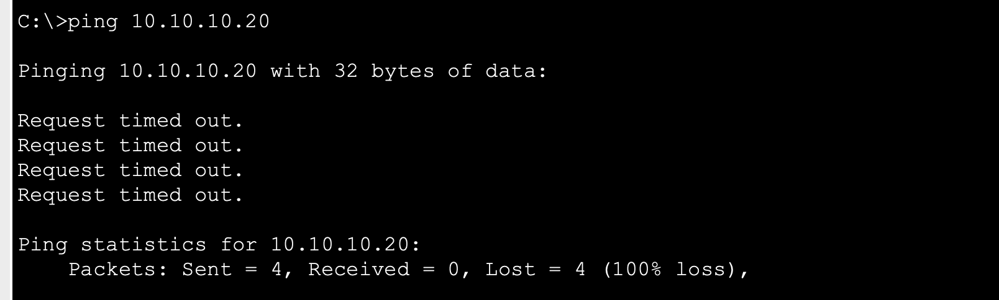
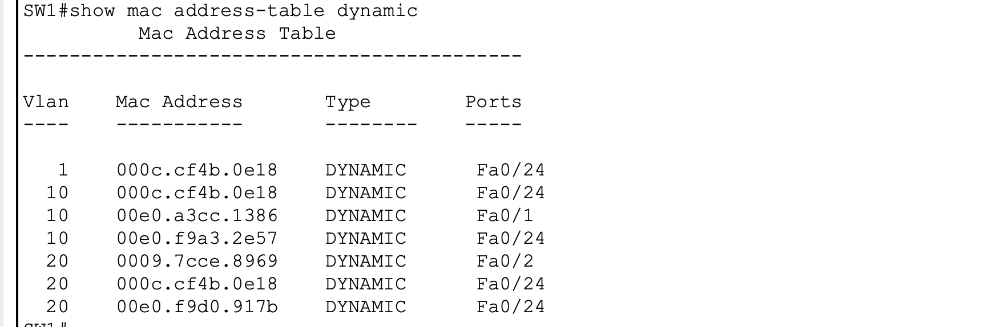
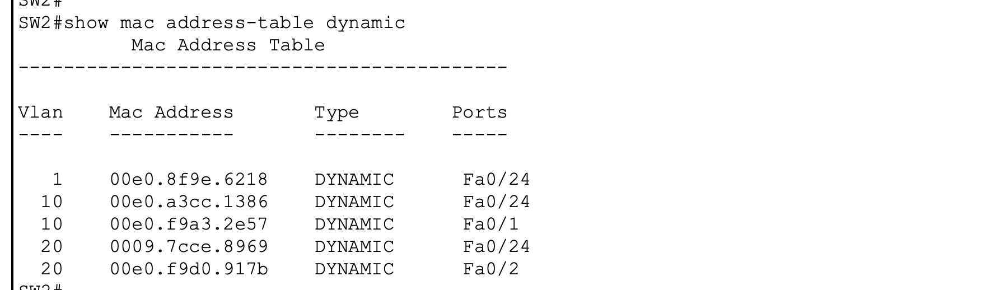

# Lab 04 — VLAN Trunking and 802.1Q
## Deep Learning Notes

---

# 1. What Problem Does Trunking Solve?

In Lab 03, VLANs were created on a single switch.

For example:

```text
SW1

Fa0/1 → VLAN 10
Fa0/2 → VLAN 10

Fa0/3 → VLAN 20
Fa0/4 → VLAN 20
```

The switch could keep VLAN 10 and VLAN 20 separate because all ports existed on the same switch.

But enterprise networks rarely consist of one switch.

Imagine adding another switch:

```text
SW1                         SW2
│                            │
PC0                          PC2
VLAN 10                      VLAN 10

PC1                          PC3
VLAN 20                      VLAN 20
```

We want:

```text
PC0 ↔ PC2
```

to work because both devices belong to VLAN 10.

We also want:

```text
PC1 ↔ PC3
```

to work because both belong to VLAN 20.

But we do NOT want:

```text
VLAN 10 ↔ VLAN 20
```

to work.

The question becomes:

> How can one physical cable between SW1 and SW2 carry both VLAN 10 and VLAN 20 without merging them?

The answer is:

**VLAN trunking.**

---

# 2. Access Port vs Trunk Port

This distinction must be understood before memorizing trunk commands.

## Access Port

An access port is normally assigned to one VLAN.

Example:

```text
PC0
 │
 │
Fa0/1
 │
 ▼
SW1
 │
 VLAN 10
```

The endpoint does not normally need to know anything about VLAN tagging.

---

## Trunk Port

A trunk can carry multiple VLANs.

```text
SW1
 │
 │ Fa0/24
 │
 ═════════════════
      TRUNK
 ═════════════════
 │
 │ Fa0/24
 ▼
SW2
```

The same physical link can transport:

```text
VLAN 10
VLAN 20
VLAN 30
...
```

provided those VLANs are permitted.

---

# 3. The Enterprise Mental Model

Think of a trunk as a highway.

```text
                 HIGHWAY
                    │
        ┌───────────┼───────────┐
        │           │           │
       VLAN 10     VLAN 20     VLAN 30
        │           │           │
      USERS       FINANCE      OTHER
```

The highway is physically one connection.

But the traffic remains logically separated.

This is why trunking is so important in enterprise switching.

---

# 4. Lab Baseline

Before configuration, Fa0/24 on both switches was not operating as a trunk.

The interface reported:

```text
Administrative Mode: dynamic auto
Operational Mode: static access
```

This means:

```text
SW1 Fa0/24
     │
     │ Access
     │
SW2 Fa0/24
```

rather than:

```text
SW1 Fa0/24
     │
     │ Trunk
     │
SW2 Fa0/24
```

---

# 5. Why the Initial Pings Failed

Before trunking, same-VLAN devices located on different switches could not communicate.

Evidence:





The important lesson is:

> Creating a VLAN on a switch does not automatically make that VLAN available across every inter-switch connection.

The VLAN must exist and be permitted across the path.

---

# 6. Trunk Configuration

Both switches were configured:

```cisco
configure terminal

interface fa0/24
 switchport mode trunk
 switchport trunk allowed vlan 10,20

end
```

Two separate concepts are being configured.

## Command 1

```cisco
switchport mode trunk
```

This tells the switch:

> Treat this interface as a trunk.

## Command 2

```cisco
switchport trunk allowed vlan 10,20
```

This tells the switch:

> Only allow VLAN 10 and VLAN 20 across this trunk.

---

# 7. Why Explicit Trunk Configuration Matters

Cisco switches support several switchport negotiation modes.

For example:

```text
dynamic auto
dynamic desirable
trunk
access
```

In an enterprise configuration, explicitly configuring infrastructure links is preferable to relying on negotiation behavior.

We used:

```cisco
switchport mode trunk
```

because the role of Fa0/24 is known:

```text
SW1 ↔ SW2
```

It is an infrastructure trunk.

---

# 8. Verifying the Trunk

The command:

```cisco
show interfaces trunk
```

reported:

```text
Fa0/24
Mode: on
Encapsulation: 802.1q
Status: trunking
Native VLAN: 1
VLANs allowed: 10,20
```

SW1:



SW2:



This is important because configuration alone is not enough.

We need to distinguish:

```text
Configured
```

from:

```text
Operational
```

A port can be configured for trunking but not actually be forwarding traffic.

---

# 9. Administrative vs Operational State

The command:

```cisco
show interfaces fa0/24 switchport
```

gave:

```text
Administrative Mode: trunk
Operational Mode: trunk
```

### Administrative Mode

What the configuration tells the interface to do.

### Operational Mode

What the interface is actually doing.

In this lab:

```text
Administrative = trunk
Operational    = trunk
```

Therefore the configuration and operational state agree.

---

# 10. 802.1Q

The trunk uses:

```text
IEEE 802.1Q
```

802.1Q provides a mechanism for identifying the VLAN associated with an Ethernet frame while it travels over a trunk.

Conceptually:

```text
Ethernet Frame
       +
VLAN identification
       =
802.1Q trunk frame
```

The endpoint PCs do not need to manually configure VLAN tags.

The switches handle trunk tagging.

---

# 11. What Happens to a Frame?

Consider:

```text
PC0 → PC2
```

Both devices belong to VLAN 10.

### Step 1 — PC0 Creates an Ethernet Frame

PC0 creates a normal Ethernet frame.

Conceptually:

```text
Source MAC: PC0
Destination MAC: PC2
```

PC0 is connected to an access port:

```text
PC0
 │
Fa0/1
 │
VLAN 10
```

---

### Step 2 — SW1 Receives the Frame

SW1 receives the frame on Fa0/1.

The switch knows:

```text
Fa0/1 → VLAN 10
```

Therefore the frame belongs to VLAN 10.

---

### Step 3 — SW1 Forwards Toward Fa0/24

The destination is reachable through SW2.

The outgoing interface is:

```text
Fa0/24
```

Fa0/24 is a trunk.

The switch therefore carries the VLAN information across the trunk.

Conceptually:

```text
PC0
 │
 ▼
SW1
 │
 │ VLAN 10
 ▼
Fa0/24
```

---

### Step 4 — Frame Crosses the Trunk

The trunk transports the VLAN 10 traffic across the physical link.

```text
SW1 ═══════════════════ SW2
          VLAN 10
```

VLAN 20 traffic can use the same physical link:

```text
SW1 ═══════════════════ SW2
          VLAN 20
```

The two VLANs remain logically separate.

---

### Step 5 — SW2 Receives the Frame

SW2 identifies the frame as belonging to VLAN 10.

It then forwards the frame toward the VLAN 10 access port:

```text
SW2
 │
 │ VLAN 10
 ▼
Fa0/1
 │
 ▼
PC2
```

---

# 12. Why PCs Don't Need Trunk Configuration

PC0 is connected to:

```text
Fa0/1
```

which is an access port.

PC0 does not need to understand:

```text
802.1Q
```

The switch handles the VLAN boundary.

Conceptually:

```text
PC
 │
 │ normal Ethernet
 ▼
ACCESS PORT
 │
 │ VLAN context added internally
 ▼
SWITCH
 │
 │ 802.1Q trunk
 ▼
TRUNK
```

This is why end devices can remain unaware of the trunking mechanism.

---

# 13. VLAN 10 Test

After trunking:



The traffic path was:

```text
PC0
 │
Fa0/1
 │
VLAN 10
 │
SW1
 │
Fa0/24
 │
802.1Q TRUNK
 │
Fa0/24
 │
SW2
 │
Fa0/1
 │
VLAN 10
 │
PC2
```

The ping succeeded.

This proves VLAN 10 crossed the trunk.

---

# 14. VLAN 20 Test

VLAN 20 was tested independently.



Traffic path:

```text
PC1
 │
Fa0/2
 │
VLAN 20
 │
SW1
 │
Fa0/24
 │
802.1Q TRUNK
 │
Fa0/24
 │
SW2
 │
Fa0/2
 │
VLAN 20
 │
PC3
```

The ping succeeded.

This proves that the same physical trunk is transporting another VLAN.

---

# 15. Why VLAN 10 and VLAN 20 Still Cannot Communicate

The trunk does not perform routing.

Therefore:

```text
PC0 VLAN 10
      │
      X
      │
PC3 VLAN 20
```

remains blocked at Layer 2.

Evidence:



To communicate between VLANs, we need Layer 3 routing.

For example:

```text
VLAN 10
10.10.10.0/24
       │
       ▼
   Router/L3 Switch
       │
       ▼
VLAN 20
10.10.20.0/24
```

That will be a future lab.

---

# 16. MAC Address Learning

This lab extends the MAC learning concepts from Lab 02.

SW1 showed MAC addresses learned through Fa0/24.



SW2 also learned remote MAC addresses through Fa0/24.



This is extremely important.

The switches do not simply say:

```text
MAC → Port
```

They maintain VLAN context.

Conceptually:

```text
VLAN 10 + MAC → Fa0/24

VLAN 20 + MAC → Fa0/24
```

Therefore the same physical port can legitimately appear for multiple VLANs.

---

# 17. Understanding the MAC Table

Suppose SW1 sees:

```text
VLAN 10
Remote-PC-MAC → Fa0/24
```

SW1 is effectively saying:

> "If I need to reach this MAC address in VLAN 10, send the frame toward SW2."

For VLAN 20:

```text
VLAN 20
Remote-PC-MAC → Fa0/24
```

SW1 is saying:

> "If I need to reach this MAC address in VLAN 20, send the frame toward SW2."

Same physical interface.

Different VLAN contexts.

---

# 18. Native VLAN

The trunk reports:

```text
Trunking Native Mode VLAN: 1
```

Therefore:

```text
Native VLAN = VLAN 1
```

The lab intentionally leaves VLAN 1 as the native VLAN.

A native VLAN is associated with the handling of untagged traffic on an 802.1Q trunk.

This topic becomes important later when discussing:

- VLAN hopping
- Native VLAN mismatch
- Trunk hardening
- Enterprise switch security

---

# 19. Allowed VLAN List

The trunk allows:

```text
VLAN 10
VLAN 20
```

because of:

```cisco
switchport trunk allowed vlan 10,20
```

This is an important enterprise configuration technique.

Instead of:

```text
Allow everything
```

we explicitly define:

```text
Allow what is required
```

This reduces unnecessary VLAN propagation.

---

# 20. What Would Happen If VLAN 10 Were Removed?

Suppose we configured:

```cisco
switchport trunk allowed vlan 20
```

Then:

```text
VLAN 20 → trunk → allowed
VLAN 10 → trunk → blocked
```

The physical link would remain operational.

The trunk could still show:

```text
Status: trunking
```

but VLAN 10 traffic would not cross it.

This distinction is important:

> A trunk can be operational while a required VLAN is missing from the allowed VLAN list.

---

# 21. Layer 2 Troubleshooting Workflow

The troubleshooting method developed in this lab is:

```text
Physical
   ↓
Interface Status
   ↓
VLAN Existence
   ↓
Access-Port Assignment
   ↓
Trunk State
   ↓
802.1Q Encapsulation
   ↓
Allowed VLANs
   ↓
Spanning Tree
   ↓
MAC Learning
   ↓
IP Configuration
```

This is much better than randomly changing commands.

---

# 22. Useful Commands

## VLAN verification

```cisco
show vlan brief
```

Answers:

> Which VLANs exist and which access ports belong to them?

---

## Interface verification

```cisco
show interfaces status
```

Answers:

> Which interfaces are connected and which VLAN are they assigned to?

---

## Trunk verification

```cisco
show interfaces trunk
```

Answers:

> Is the interface trunking, which encapsulation is being used, and which VLANs are allowed?

---

## Detailed switchport verification

```cisco
show interfaces fa0/24 switchport
```

Answers:

> What is the administrative mode, operational mode, encapsulation, native VLAN, and allowed VLAN state?

---

## MAC verification

```cisco
show mac address-table dynamic
```

Answers:

> Which MAC addresses has the switch learned, in which VLAN, and through which interface?

---

# 23. Evidence-Based Troubleshooting

This lab provides a useful troubleshooting example.

### Before trunking

```text
Same VLAN across switches
        ↓
FAIL
```

### Configure trunk

```text
switchport mode trunk
switchport trunk allowed vlan 10,20
```

### Verify

```text
show interfaces trunk
```

Result:

```text
trunking
802.1q
10,20 allowed
```

### Test again

```text
VLAN 10 → PASS
VLAN 20 → PASS
```

### Test different VLANs

```text
VLAN 10 → VLAN 20
        ↓
FAIL
```

That final failure is not a problem.

It is expected behavior.

---

# 24. The Most Important Mental Model

Do not memorize:

```cisco
switchport mode trunk
```

without understanding what it accomplishes.

Remember:

```text
ACCESS PORT
    │
    └── One VLAN

TRUNK PORT
    │
    ├── VLAN 10
    ├── VLAN 20
    ├── VLAN 30
    └── ...
```

The physical topology can therefore remain simple while the logical topology becomes much larger.

---

# 25. Lab Conclusion

This lab proved that:

```text
                ONE PHYSICAL LINK
                       │
                       ▼
              ┌─────────────────┐
              │   802.1Q TRUNK  │
              └─────────────────┘
                    │       │
                    ▼       ▼
                 VLAN 10  VLAN 20
                    │       │
                  USERS   FINANCE
```

VLAN 10 and VLAN 20 can span multiple switches without becoming one broadcast domain.

Same-VLAN communication succeeds across the trunk.

Inter-VLAN communication remains blocked because routing has not been introduced.

MAC addresses for remote devices are learned through the trunk interface.

The most important distinction established by this lab is:

```text
VLAN
  ↓
Layer 2 segmentation

TRUNK
  ↓
Layer 2 VLAN transport

ROUTER / L3 SWITCH
  ↓
Layer 3 communication between VLANs
```

This distinction will form the foundation for the next Layer 3 labs.
