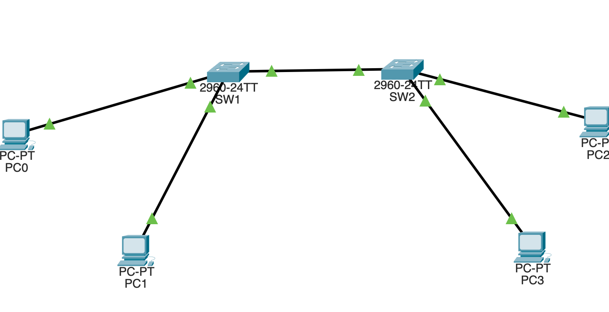

# Lab 04 — VLAN Trunking and 802.1Q

## Overview

This lab demonstrates how multiple VLANs can be transported between two Layer 2 switches using a single IEEE 802.1Q trunk link.

The lab builds directly on **Lab 03 — VLAN Segmentation and Layer 2 Broadcast Domains**.

In Lab 03, VLAN 10 and VLAN 20 existed on a single switch.

In this lab, the network is expanded to two switches:

```text
                    802.1Q TRUNK
             VLAN 10 + VLAN 20
        ┌──────────────────────────┐
        │                          │
       SW1 ======================= SW2
        │          Fa0/24          │
        │                          │
   ┌────┴────┐                ┌────┴────┐
   │         │                │         │
 VLAN 10   VLAN 20          VLAN 10   VLAN 20
 USERS     FINANCE           USERS     FINANCE
```

The objective is not simply to configure a trunk.

The objective is to **prove what trunking changes at Layer 2** and to understand why same-VLAN communication works across switches while inter-VLAN communication continues to fail.

---

# 1. Learning Objectives

By completing this lab, the following concepts were demonstrated:

- VLANs spanning multiple switches
- Access ports versus trunk ports
- IEEE 802.1Q trunking
- Native VLAN
- Allowed VLAN lists
- Same-VLAN communication across switches
- Inter-VLAN isolation
- MAC address learning through a trunk
- Layer 2 forwarding across multiple switches
- Layer 2 troubleshooting methodology
- Difference between trunking and routing

---

# 2. Enterprise Scenario

A small enterprise has two departments:

| Department | VLAN | Purpose |
|---|---:|---|
| USERS | 10 | Employee endpoints |
| FINANCE | 20 | Finance department endpoints |

The organization has two access switches.

Users on both switches must remain in the same logical VLAN even though they are physically connected to different switches.

The required design is:

```text
VLAN 10 USERS
PC0 ─── SW1 ═════════ SW2 ─── PC2
              TRUNK

VLAN 20 FINANCE
PC1 ─── SW1 ═════════ SW2 ─── PC3
              TRUNK
```

The physical link between SW1 and SW2 is one cable.

The logical network contains two VLANs.

This is the fundamental purpose of trunking.

---

# 3. Topology



### Logical topology

```text
                         SW1                     SW2
                    ┌──────────┐           ┌──────────┐
                    │          │           │          │
PC0 ───── Fa0/1 ────┤ VLAN 10  │           │ VLAN 10 ├──── Fa0/1 ─── PC2
                    │          │           │          │
PC1 ───── Fa0/2 ────┤ VLAN 20  │           │ VLAN 20 ├──── Fa0/2 ─── PC3
                    │          │           │          │
                    │ Fa0/24   ╞═══════════╡ Fa0/24   │
                    └──────────┘  802.1Q   └──────────┘
```

The inter-switch connection is:

```text
SW1 Fa0/24
      │
      │ 802.1Q trunk
      │
SW2 Fa0/24
```

The trunk is configured to carry:

```text
VLAN 10
VLAN 20
```

---

# 4. VLAN and Port Assignment

## SW1

| Interface | VLAN  | Device    |
|-----------|-------|-----------|
| Fa0/1     | 10    |       PC0 |
| Fa0/2     | 20    |       PC1 |
| Fa0/24    | Trunk |       SW2 |

## SW2

| Interface | VLAN  | Device    |
|-----------|-------|-----------|
| Fa0/1     | 10    |       PC2 |
| Fa0/2     | 20    |       PC3 |
| Fa0/24    | Trunk |       SW1 |

The access ports connect endpoint devices.

The trunk connects network infrastructure.

---

# 5. Baseline — Before Trunking

Before configuring the trunk, Fa0/24 on both switches was not operating as a trunk.

The interface was operating as an access port.

The relevant state was:

```text
Administrative Mode: dynamic auto
Operational Mode: static access
Access Mode VLAN: 1
```

This means the inter-switch link was not providing the required VLAN transport.

## VLAN 20 Test — Before Trunking


## VLAN 10 Test — Before Trunking


These failures establish the baseline.

The problem was not simply that the PCs were connected to different switches.

The problem was that the inter-switch link was not configured to transport VLAN 10 and VLAN 20 as a trunk.

---

# 6. Trunk Configuration

Fa0/24 was configured on both switches:

```cisco
interface FastEthernet0/24
 switchport mode trunk
 switchport trunk allowed vlan 10,20
```

### Configuration decisions

`switchport mode trunk`

Explicitly places the interface into trunk mode.

`switchport trunk allowed vlan 10,20`

Restricts the trunk to the VLANs required by the design.

This is preferable to blindly allowing every VLAN when only specific VLANs are required.

---

# 7. Verifying the Trunk

The trunk was verified using:

```cisco
show interfaces trunk
```

## SW1


## SW2


Both switches reported:

```text
Fa0/24
802.1q
trunking
VLANs allowed: 10,20
```

This confirms that the trunk is operational on both sides.

---

# 8. Detailed Switchport Verification

The interface was also verified using:

```cisco
show interfaces fa0/24 switchport
```

The important output was:

```text
Administrative Mode: trunk
Operational Mode: trunk

Administrative Trunking Encapsulation: dot1q
Operational Trunking Encapsulation: dot1q

Trunking Native Mode VLAN: 1

Trunking VLANs Enabled: 10,20
```

This provides stronger evidence than simply seeing the interface configured.

It proves that the interface is **operationally functioning as an 802.1Q trunk**.

---

# 9. VLAN 20 Across the Trunk

After trunk configuration, VLAN 20 communication between the two switches succeeded.


Traffic path:

```text
PC1
 │
 │ VLAN 20
 ▼
SW1 Fa0/2
 │
 ▼
SW1
 │
 │ 802.1Q trunk
 │
 ▼
SW2
 │
 ▼
SW2 Fa0/2
 │
 ▼
PC3
```

The important observation is that the frame travels through the same physical Fa0/24 link used by VLAN 10.

The VLAN identity is preserved across the trunk.

---

# 10. VLAN 10 Across the Trunk

VLAN 10 was independently tested.


Traffic path:

```text
PC0
 │
 │ VLAN 10
 ▼
SW1 Fa0/1
 │
 ▼
SW1
 │
 │ 802.1Q trunk
 │
 ▼
SW2
 │
 ▼
SW2 Fa0/1
 │
 ▼
PC2
```

The successful result proves that VLAN 10 is also being transported between the switches.

---

# 11. What the Trunk Actually Achieved

Before trunking:

```text
SW1 Fa0/24 ───────── SW2 Fa0/24

        Access behavior
             VLAN 1
```

After trunking:

```text
SW1 Fa0/24 ═════════ SW2 Fa0/24

          802.1Q TRUNK

          ┌──────────┐
          │ VLAN 10  │
          ├──────────┤
          │ VLAN 20  │
          └──────────┘
```

One physical interface can therefore carry multiple logical Layer 2 networks.

This is the central purpose of trunking.

---

# 12. Inter-VLAN Isolation Remains

Trunking does **not** cause VLAN 10 and VLAN 20 to communicate with each other.


The test remained unsuccessful:

```text
VLAN 10 → VLAN 20
```

This is expected.

The trunk transports VLANs.

It does not route between them.

Therefore:

```text
Trunking ≠ Routing
```

To allow:

```text
10.10.10.0/24
        ↕
10.10.20.0/24
```

a Layer 3 device would be required.

That topic will be introduced in the inter-VLAN routing lab.

---

# 13. MAC Address Learning Across the Trunk

This lab also connects directly to the MAC-learning concepts demonstrated in Lab 02.

After generating traffic, the MAC address tables were inspected.

```cisco
show mac address-table dynamic
```

## SW1


SW1 learned local devices through access ports and remote devices through Fa0/24.

Conceptually:

```text
VLAN 10
Local MAC  → Fa0/1
Remote MAC → Fa0/24

VLAN 20
Local MAC  → Fa0/2
Remote MAC → Fa0/24
```

## SW2


SW2 learned the reverse path.

Conceptually:

```text
VLAN 10
Local MAC  → Fa0/1
Remote MAC → Fa0/24

VLAN 20
Local MAC  → Fa0/2
Remote MAC → Fa0/24
```

This demonstrates an important switching concept:

> The physical trunk interface can be the forwarding path for MAC addresses belonging to multiple VLANs.

The VLAN context is still preserved.

---

# 14. Native VLAN

The trunk reported:

```text
Trunking Native Mode VLAN: 1
```

Therefore VLAN 1 is the native VLAN for this lab.

The trunk explicitly permits:

```text
VLAN 10
VLAN 20
```

The native VLAN was not changed because this lab is focused on understanding trunk operation.

Native VLAN security and production hardening will be covered separately.

---

# 15. Allowed VLAN List

The trunk was configured with:

```cisco
switchport trunk allowed vlan 10,20
```

Therefore only the required VLANs are permitted across the trunk.

Conceptually:

```text
              Fa0/24
                │
        ┌───────┴───────┐
        │               │
      VLAN 10         VLAN 20
      ALLOWED          ALLOWED

      VLAN 30         NOT ALLOWED
      VLAN 40         NOT ALLOWED
```

This demonstrates a basic enterprise principle:

> Only required VLANs should be carried across a trunk.

---

# 16. Verification Commands

The following commands were used throughout the lab:

```cisco
show vlan brief
show interfaces status
show interfaces trunk
show interfaces fa0/24 switchport
show mac address-table dynamic
show running-config
```

Endpoint connectivity was tested using:

```text
ping <destination-IP>
```

---

# 17. Evidence Summary

| Evidence                 | Result                     |
|--------------------------|----------------------------|
| Pre-trunk VLAN 10        | FAIL                       |
| Pre-trunk VLAN 20        | FAIL                       |
| SW1 trunk                | PASS                       |
| SW2 trunk                | PASS                       |
| VLAN 10 across trunk     | PASS                       |
| VLAN 20 across trunk     | PASS                       |
| Cross-VLAN communication | FAIL as expected           |
| SW1 remote MAC learning  | PASS                       |
| SW2 remote MAC learning  | PASS                       |
| VLAN 10 allowed          | PASS                       |
| VLAN 20 allowed          | PASS                       |
| 802.1Q operational       | PASS                       |

---

# 18. Troubleshooting Methodology

If same-VLAN communication fails across switches, the troubleshooting sequence used in this lab is:

```text
1. Verify physical connectivity
        ↓
2. Verify VLAN exists
        ↓
3. Verify access-port VLAN assignment
        ↓
4. Verify interface status
        ↓
5. Verify trunk state
        ↓
6. Verify 802.1Q encapsulation
        ↓
7. Verify allowed VLAN list
        ↓
8. Verify STP forwarding state
        ↓
9. Verify MAC address learning
        ↓
10. Verify endpoint IP configuration
```

This prevents troubleshooting from becoming guesswork.

---

# 19. Key Takeaways

### Access Port

```text
Fa0/1 → VLAN 10
```

Normally carries traffic for one VLAN.

### Trunk Port

```text
Fa0/24 → VLAN 10 + VLAN 20
```

Carries multiple VLANs across one physical link.

### VLAN

Creates a separate Layer 2 broadcast domain.

### 802.1Q

Provides VLAN identification across a trunk.

### Trunking

Transports VLANs.

### Routing

Moves traffic between different IP networks/VLANs.

---

# Final Result

The lab successfully demonstrated that:

```text
                 ONE PHYSICAL LINK
                       │
                       ▼
              ┌─────────────────┐
              │   802.1Q TRUNK  │
              └─────────────────┘
                    │       │
                    ▼       ▼
                 VLAN 10  VLAN 20
                    │       │
                  USERS   FINANCE
```

VLAN 10 and VLAN 20 can span multiple switches while remaining separate Layer 2 broadcast domains.

The switches successfully learned remote MAC addresses through the trunk, same-VLAN communication succeeded, and inter-VLAN communication remained isolated.

**Lab 04 complete.**
