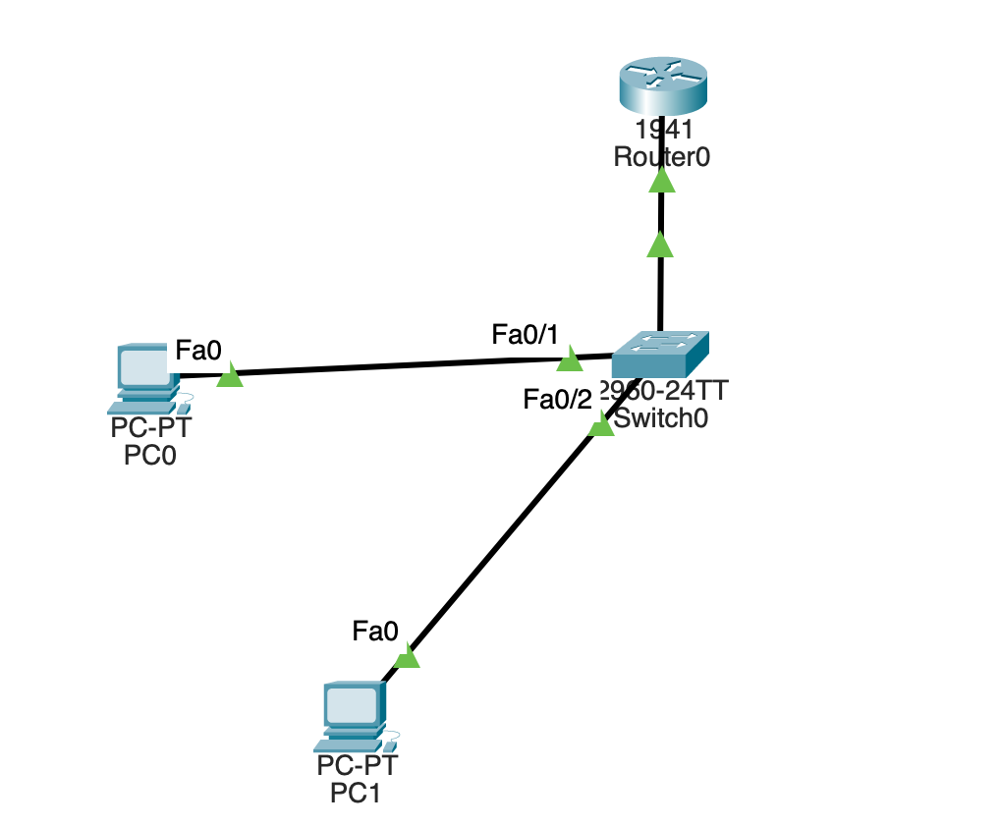

# Inter-VLAN Routing with Router-on-a-Stick

## Objective

Configure and verify inter-VLAN routing between two separate Layer 2 broadcast domains using a Cisco router and a single 802.1Q trunk.

This lab extends the previous VLAN segmentation and trunking labs.

Previously, VLAN 10 and VLAN 20 were successfully isolated from each other. In this lab, a router is introduced to provide Layer 3 connectivity between those networks.

The lab demonstrates:

* VLAN segmentation
* Access-port configuration
* 802.1Q trunking
* VLAN tagging
* Router-on-a-Stick
* Router subinterfaces
* Default gateways
* Inter-VLAN routing
* Connected and local routes
* MAC address learning
* Layer 2 vs Layer 3 troubleshooting
* Bidirectional connectivity verification

---

## Enterprise Scenario

A small enterprise has two departments:

| VLAN | Department | Network           | Gateway        |
| ---: | ---------- | ----------------- | -------------- |
|   10 | USERS      | `192.168.10.0/24` | `192.168.10.1` |
|   20 | FINANCE    | `192.168.20.0/24` | `192.168.20.1` |

The departments must remain in separate broadcast domains for Layer 2 segmentation.

However, users now need to communicate with systems in the other department.

A Layer 3 routing device is therefore required.

For this lab, the router uses **Router-on-a-Stick** rather than separate physical interfaces for every VLAN.

---

# 1. Topology



The topology consists of:

```text
                         R1
                    G0/0 │
                         │
                  802.1Q TRUNK
                   VLAN 10,20
                         │
                       Fa0/24
                         │
                        SW1
                    ┌────┴────┐
                    │         │
                  Fa0/1     Fa0/2
                    │         │
                   PC0       PC1
                 VLAN 10   VLAN 20
              192.168.10.10  192.168.20.10
```

The important design point is that **Fa0/24 is a trunk**, while Fa0/1 and Fa0/2 are access ports.

---

# 2. Why Routing Is Required

A VLAN represents a separate Layer 2 broadcast domain.

Therefore:

```text
VLAN 10
192.168.10.0/24
```

and:

```text
VLAN 20
192.168.20.0/24
```

are separate networks.

A Layer 2 switch can forward frames within a VLAN, but it does not automatically route traffic between those networks.

Conceptually:

```text
VLAN 10 ───── SW1 ───── VLAN 20
                 │
                 ❌
```

Without a Layer 3 device, communication between the two networks fails.

This behavior was intentionally established in the earlier VLAN labs.

The purpose of this lab is to introduce the Layer 3 device that removes that limitation.

---

# 3. VLAN Configuration

SW1 contains two departmental VLANs:

```text
VLAN 10 → USERS
VLAN 20 → FINANCE
```

The endpoint ports are configured as access ports.

```text
Fa0/1 → VLAN 10
Fa0/2 → VLAN 20
```


This screenshot provides evidence that the VLANs exist and that the correct access ports belong to each VLAN.

The endpoints therefore enter the switch as untagged Ethernet traffic and are internally associated with their respective VLANs.

---

# 4. The 802.1Q Trunk

The connection between SW1 and R1 uses:

```text
SW1 Fa0/24
      │
      │ 802.1Q
      │
R1 G0/0
```

The trunk is configured to carry:

```text
VLAN 10
VLAN 20
```

Verification:


The important output is:

```text
Status: trunking
Encapsulation: 802.1q
VLANs allowed: 10,20
```

This means a single physical Ethernet link can transport traffic belonging to both VLANs.

---

# 5. Why the Trunk Is Necessary

Without the trunk, the router would have no way to distinguish traffic belonging to VLAN 10 from traffic belonging to VLAN 20 over the same physical interface.

The trunk carries VLAN information using **IEEE 802.1Q tagging**.

Conceptually:

```text
VLAN 10 frame
      │
      ▼
802.1Q tag = 10
      │
      ▼
     R1
```

and:

```text
VLAN 20 frame
      │
      ▼
802.1Q tag = 20
      │
      ▼
     R1
```

The router uses these VLAN IDs to determine which logical subinterface should process the traffic.

---

# 6. Router Physical Interface

R1 uses a single physical interface:

```text
GigabitEthernet0/0
```

The interface is operational:


The physical interface itself does not need a separate IP address for this Router-on-a-Stick design.

Instead, logical subinterfaces are created underneath it.

---

# 7. Router Subinterfaces

The physical interface is divided into logical interfaces:

```text
G0/0
│
├── G0/0.10 → VLAN 10
│              192.168.10.1
│
└── G0/0.20 → VLAN 20
               192.168.20.1
```

The relevant configuration is shown in the router subinterface evidence:


The VLAN association is established with:

```cisco
encapsulation dot1Q 10
```

for VLAN 10 and:

```cisco
encapsulation dot1Q 20
```

for VLAN 20.

The router therefore knows which VLAN each logical interface represents.

---

# 8. VLAN 10 Gateway

The VLAN 10 subinterface is:

```text
G0/0.10
```

with:

```text
IP address: 192.168.10.1/24
```

This becomes the default gateway for hosts in VLAN 10.

PC0 uses:

```text
IP address:      192.168.10.10
Subnet mask:     255.255.255.0
Default gateway: 192.168.10.1
```

The relationship is:

```text
PC0
192.168.10.10
      │
      ▼
G0/0.10
192.168.10.1
```

---

# 9. VLAN 20 Gateway

The VLAN 20 subinterface is:

```text
G0/0.20
```

with:

```text
IP address: 192.168.20.1/24
```

PC1 uses:

```text
IP address:      192.168.20.10
Subnet mask:     255.255.255.0
Default gateway: 192.168.20.1
```

The relationship is:

```text
PC1
192.168.20.10
      │
      ▼
G0/0.20
192.168.20.1
```

---

# 10. Interface Verification

R1 reports the following logical interfaces as operational:

```text
G0/0.10 → 192.168.10.1 → up/up
G0/0.20 → 192.168.20.1 → up/up
```

This is important because a correctly configured IP address is not enough.

The interface must also be operational at the physical and data-link levels.

The captured interface-status evidence demonstrates that the Router-on-a-Stick interfaces are operational.

---

# 11. Routing Table

R1 automatically learns both networks as directly connected networks.


The important entries are:

```text
C  192.168.10.0/24
C  192.168.20.0/24
```

`C` means **Connected**.

R1 therefore knows:

```text
192.168.10.0/24
        │
      G0/0.10
```

and:

```text
192.168.20.0/24
        │
      G0/0.20
```

The router does not require static routes for these networks because they are directly connected.

---

# 12. Understanding the Local Routes

The routing table also contains:

```text
L 192.168.10.1/32
L 192.168.20.1/32
```

`L` means **Local**.

These entries represent the router's own interface addresses.

Therefore:

```text
G0/0.10
192.168.10.1
```

produces both:

```text
C 192.168.10.0/24
L 192.168.10.1/32
```

Likewise:

```text
G0/0.20
192.168.20.1
```

produces:

```text
C 192.168.20.0/24
L 192.168.20.1/32
```

This is why the routing table contains two entries for each network.

---

# 13. Gateway Verification — VLAN 10

Before testing inter-VLAN communication, PC0 was tested against its own gateway.

```text
PC0
192.168.10.10
      │
      ▼
192.168.10.1
```


Successful replies prove that PC0 can reach its Layer 3 gateway.

This verifies the path:

```text
PC0 → SW1 → VLAN 10 → trunk → R1 G0/0.10
```

---

# 14. Gateway Verification — VLAN 20

PC1 was also tested against its own gateway:

```text
PC1
192.168.20.10
      │
      ▼
192.168.20.1
```


Successful replies demonstrate that VLAN 20 can reach its Layer 3 gateway.

At this point both VLANs have functioning Layer 3 gateways.

---

# 15. Inter-VLAN Routing Test

The key test is communication between different VLANs.

PC0:

```text
192.168.10.10
VLAN 10
```

successfully pinged PC1:

```text
192.168.20.10
VLAN 20
```


This is significant because the two hosts belong to:

```text
Different VLANs
Different broadcast domains
Different IP networks
```

The successful ping therefore proves that R1 is performing Layer 3 routing between the two networks.

---

# 16. Reverse Inter-VLAN Test

The reverse direction was also tested.

PC1:

```text
192.168.20.10
```

successfully reached PC0:

```text
192.168.10.10
```


This confirms that routing works in both directions rather than only in one direction.

---

# 17. What Happens to the Packet?

Consider PC0 communicating with PC1.

PC0 determines that:

```text
192.168.20.10
```

is outside its local network:

```text
192.168.10.0/24
```

Therefore, PC0 sends the packet toward its default gateway:

```text
192.168.10.1
```

The path is:

```text
PC0
192.168.10.10
     │
     │ VLAN 10
     ▼
   SW1
     │
     │ 802.1Q VLAN 10
     ▼
  R1 G0/0
     │
     ▼
 G0/0.10
192.168.10.1
     │
     │ Layer 3 routing
     ▼
 G0/0.20
192.168.20.1
     │
     │ VLAN 20
     ▼
   SW1
     │
     ▼
   PC1
192.168.20.10
```

The router removes the Layer 2 context from the incoming frame, examines the Layer 3 destination, determines the correct outgoing interface, and forwards the packet toward VLAN 20.

---

# 18. MAC Address Learning Still Happens

Introducing routing does not eliminate Layer 2 switching.

SW1 continues to learn MAC addresses.


The switch maintains Layer 2 forwarding information for each VLAN.

This demonstrates an important distinction:

| Mechanism           |   Layer | Purpose                              |
| ------------------- | ------: | ------------------------------------ |
| MAC address table   | Layer 2 | Forward Ethernet frames              |
| VLAN                | Layer 2 | Separate broadcast domains           |
| 802.1Q trunk        | Layer 2 | Transport multiple VLANs             |
| Routing table       | Layer 3 | Determine where IP packets should go |
| Router subinterface | Layer 3 | Provide a gateway for a VLAN         |

---

# 19. Switch Trunk Configuration

The switch configuration provides the Layer 2 foundation for Router-on-a-Stick.


The relevant configuration includes:

```cisco
interface FastEthernet0/24
 switchport mode trunk
 switchport trunk allowed vlan 10,20
```

This establishes Fa0/24 as the trunk toward R1 and limits the trunk to the VLANs required by the lab.

---

# 20. Why the Router Does Not Show a Switch Trunk

A common misconception is that both devices should show:

```text
show interfaces trunk
```

with the same output.

SW1 does:

```cisco
show interfaces trunk
```

because Fa0/24 is a switchport operating as a trunk.

R1 is different.

R1's G0/0 is a routed physical interface with logical subinterfaces:

```text
G0/0.10
G0/0.20
```

Therefore the router is verified using commands such as:

```cisco
show ip interface brief
show ip route
show running-config
```

The absence of output from `show interfaces trunk` on the router is therefore expected.

---

# 21. Troubleshooting Experience

This lab also included a practical Layer 1/Layer 2 troubleshooting scenario.

Initially, SW1 reported:

```text
Fa0/24
notconnect
```

while the interface was administratively configured as a trunk.

Further investigation showed that R1's physical interface was:

```text
GigabitEthernet0/0
administratively down
down
```

The problem was therefore not the VLAN configuration.

The router interface had to be enabled:

```cisco
interface GigabitEthernet0/0
 no shutdown
```

After the interface became operational, the switch trunk came up.

This demonstrates a fundamental troubleshooting principle:

```text
Layer 1
   ↓
Layer 2
   ↓
Layer 3
```

Do not immediately troubleshoot routing when the physical link itself is down.

---

# 22. Verification Summary

| Test / Configuration  | Expected     | Result |
| --------------------- | ------------ | ------ |
| VLAN 10               | Active       | PASS   |
| VLAN 20               | Active       | PASS   |
| Fa0/24                | 802.1Q trunk | PASS   |
| VLAN 10 allowed       | Yes          | PASS   |
| VLAN 20 allowed       | Yes          | PASS   |
| R1 G0/0               | Up/Up        | PASS   |
| G0/0.10               | Up/Up        | PASS   |
| G0/0.20               | Up/Up        | PASS   |
| PC0 → VLAN 10 gateway | Success      | PASS   |
| PC1 → VLAN 20 gateway | Success      | PASS   |
| PC0 → PC1             | Success      | PASS   |
| PC1 → PC0             | Success      | PASS   |
| VLAN 10 route         | Connected    | PASS   |
| VLAN 20 route         | Connected    | PASS   |
| MAC learning          | Verified     | PASS   |

---

# 23. Key Commands

## SW1

```cisco
show vlan brief
show interfaces trunk
show mac address-table dynamic
show running-config | section interface FastEthernet0/24
```

## R1

```cisco
show ip interface brief
show ip route
show running-config | section interface GigabitEthernet0/0
```

## End Hosts

```text
ipconfig
ping <destination>
```

---


### Why can't two VLANs communicate through a normal Layer 2 switch?

Because each VLAN is a separate broadcast domain and a Layer 2 switch does not perform IP routing between those networks.

### What does Router-on-a-Stick mean?

It means using one physical router interface with multiple logical subinterfaces, with each subinterface associated with a different VLAN.

### Why is the switch-to-router link a trunk?

Because the single physical link must transport traffic from multiple VLANs.

### What does `encapsulation dot1Q 10` mean?

It associates the router subinterface with VLAN 10 and tells the router to process IEEE 802.1Q-tagged traffic belonging to VLAN 10.

### Why does each VLAN need a different gateway?

Each VLAN represents a different IP network, so each network requires a Layer 3 gateway for traffic leaving that network.

### Why does R1 automatically have routes to both networks?

Because both networks are directly connected to R1 through its subinterfaces.

### Does the switch perform the inter-VLAN routing?

No. SW1 performs Layer 2 switching. R1 performs the Layer 3 routing.

---

# 25. Final Architecture

The completed design can be summarized as:

```text
                         R1
                         │
                  G0/0 physical
                         │
              ┌──────────┴──────────┐
              │                     │
           G0/0.10               G0/0.20
           VLAN 10               VLAN 20
        192.168.10.1          192.168.20.1
              │                     │
              └──────────┬──────────┘
                         │
                    802.1Q trunk
                    VLAN 10,20
                         │
                       SW1
                    ┌────┴────┐
                    │         │
                 Fa0/1     Fa0/2
                    │         │
                   PC0       PC1
               VLAN 10     VLAN 20
             .10.10       .20.10
```

The resulting architecture provides:

**Layer 2 segmentation + 802.1Q VLAN transport + Layer 3 inter-VLAN routing.**

---

## Conclusion

This lab demonstrates how a network can preserve VLAN-based segmentation while still allowing controlled communication between different IP networks.

The switch provides:

* VLAN separation
* Access-port connectivity
* 802.1Q trunking
* MAC-based Layer 2 forwarding

The router provides:

* Default gateways
* Layer 3 routing
* Communication between VLAN 10 and VLAN 20

The successful bidirectional ping tests provide final proof that the design works end-to-end.

The most important concept demonstrated by this lab is:

> **VLANs separate networks at Layer 2; trunks transport those VLANs; routers provide Layer 3 communication between them.**
