# Lab 05 — Inter-VLAN Routing Verification Results

## 1. Verification Objective

The purpose of this verification is to prove that the configured Router-on-a-Stick topology provides working Layer 3 communication between VLAN 10 and VLAN 20.

The verification process checks the network from the bottom up:

```text
Physical connectivity
        ↓
VLAN configuration
        ↓
802.1Q trunk
        ↓
Router subinterfaces
        ↓
Default gateways
        ↓
Routing table
        ↓
Inter-VLAN connectivity
        ↓
MAC address learning
```

The final success criterion is bidirectional communication between hosts located in different VLANs.

---

# 2. VLAN Verification

The first verification step was confirming that the required VLANs existed on SW1 and that the endpoint ports were assigned correctly.

Expected design:

| VLAN | Name    | Access Port |
| ---: | ------- | ----------- |
|   10 | USERS   | Fa0/1       |
|   20 | FINANCE | Fa0/2       |

Evidence:

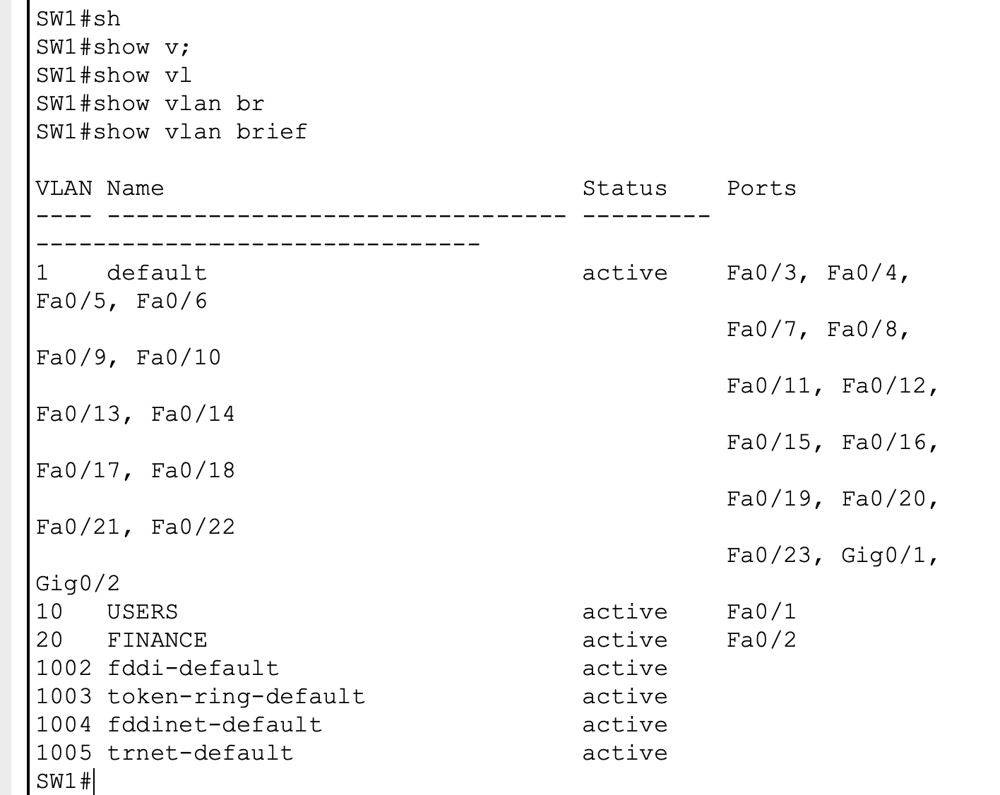

### Result

**PASS**

VLAN 10 and VLAN 20 were present and active.

The endpoint ports were associated with the intended VLANs.

### What this proves

The Layer 2 segmentation required by the design is in place before routing is introduced.

---

# 3. Trunk Verification

The connection carrying the VLANs toward R1 was verified with:

```cisco
show interfaces trunk
```

Evidence:

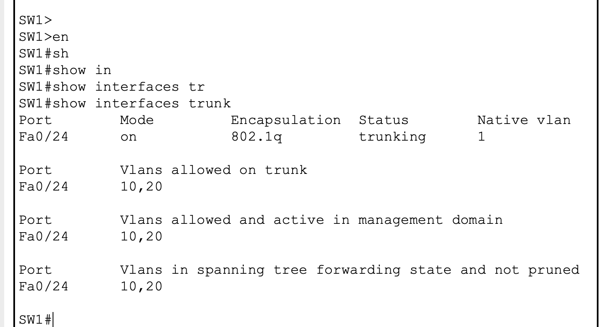

The trunk showed:

```text
Port        Mode         Encapsulation  Status        Native vlan
Fa0/24      on           802.1q         trunking      1
```

and:

```text
Port        Vlans allowed on trunk

Fa0/24      10,20
```

### Result

**PASS**

Fa0/24 is operational as an 802.1Q trunk and permits VLAN 10 and VLAN 20.

### What this proves

The switch can transport both VLANs across the single physical link toward R1.

---

# 4. Router Physical Interface Verification

R1 was checked using:

```cisco
show ip interface brief
```

Evidence:

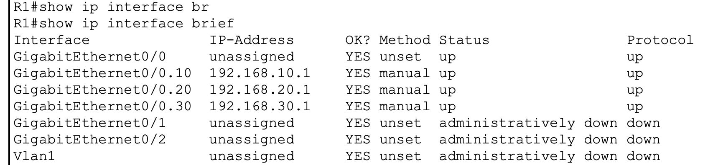

The physical interface:

```text
GigabitEthernet0/0
```

was verified as:

```text
up
up
```

### Result

**PASS**

The physical interface connecting R1 to SW1 is operational.

### Why this matters

Router-on-a-Stick depends on the physical interface being operational.

If G0/0 is administratively down or physically down, the subinterfaces cannot provide working connectivity regardless of whether their IP configuration is correct.

---

# 5. Router Subinterface Verification

The router configuration was examined to verify the VLAN-to-subinterface mappings.

Evidence:

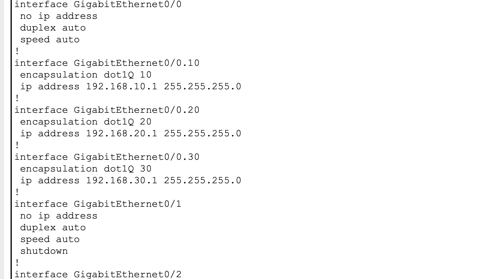

The expected mappings are:

```text
G0/0.10 → VLAN 10 → 192.168.10.1/24
G0/0.20 → VLAN 20 → 192.168.20.1/24
```

The configuration uses:

```cisco
encapsulation dot1Q 10
```

and:

```cisco
encapsulation dot1Q 20
```

### Result

**PASS**

Each VLAN has a dedicated router subinterface and Layer 3 gateway.

### What this proves

R1 is capable of identifying VLAN 10 and VLAN 20 traffic arriving through the same physical interface.

---

# 6. Routing Table Verification

R1 was checked with:

```cisco
show ip route
```

Evidence:

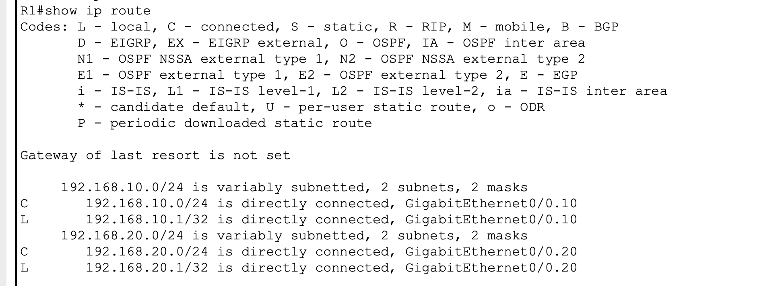

The routing table contained directly connected networks:

```text
C 192.168.10.0/24
C 192.168.20.0/24
```

It also contained local routes for the router's own addresses:

```text
L 192.168.10.1/32
L 192.168.20.1/32
```

### Result

**PASS**

R1 has Layer 3 knowledge of both VLAN networks.

### What this proves

No static routes are required for communication between these two directly connected networks.

R1 already knows where both networks are located through its subinterfaces.

---

# 7. VLAN 10 Default Gateway Test

PC0 belongs to VLAN 10:

```text
IP address:      192.168.10.10
Default gateway: 192.168.10.1
```

The first host-level test was to reach its own gateway.

Evidence:

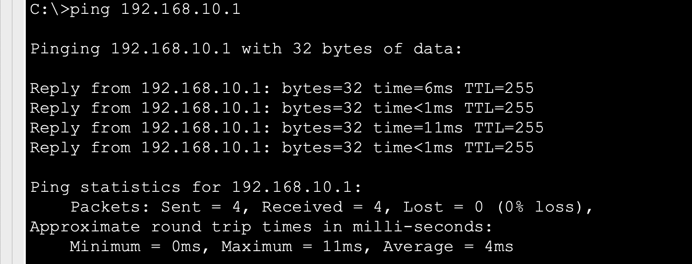

### Result

**PASS**

PC0 successfully reached:

```text
192.168.10.1
```

### What this proves

The following path is functioning:

```text
PC0
  ↓
SW1 Fa0/1
  ↓
VLAN 10
  ↓
SW1 Fa0/24
  ↓
802.1Q trunk
  ↓
R1 G0/0.10
```

This verifies the VLAN 10 Layer 2 and Layer 3 path.

---

# 8. VLAN 20 Default Gateway Test

PC1 belongs to VLAN 20:

```text
IP address:      192.168.20.10
Default gateway: 192.168.20.1
```

PC1 was tested against its default gateway.

Evidence:

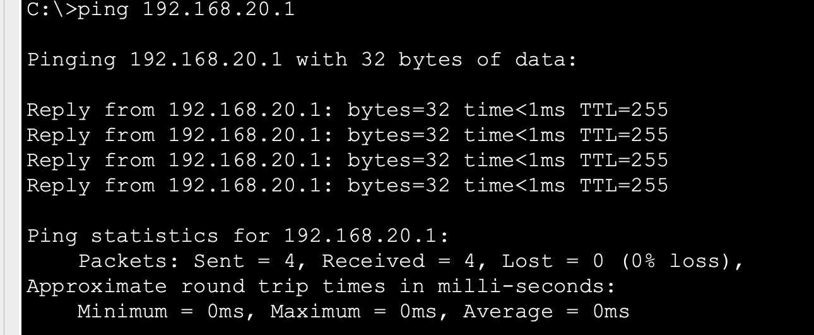

### Result

**PASS**

PC1 successfully reached:

```text
192.168.20.1
```

### What this proves

The VLAN 20 path is functioning:

```text
PC1
  ↓
SW1 Fa0/2
  ↓
VLAN 20
  ↓
SW1 Fa0/24
  ↓
802.1Q trunk
  ↓
R1 G0/0.20
```

Both VLANs can therefore independently reach their Layer 3 gateway.

---

# 9. Inter-VLAN Test — VLAN 10 → VLAN 20

PC0 was used to test communication from VLAN 10 to VLAN 20.

Source:

```text
192.168.10.10
VLAN 10
```

Destination:

```text
192.168.20.10
VLAN 20
```

Evidence:

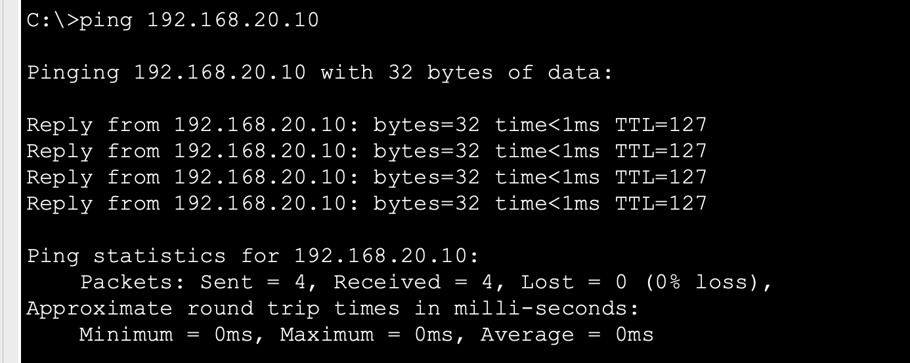

The ping was successful.

### Result

**PASS**

### Why this is important

The source and destination are in different IP networks:

```text
192.168.10.0/24
192.168.20.0/24
```

and different VLANs:

```text
VLAN 10
VLAN 20
```

Therefore, the traffic could not remain entirely within Layer 2 switching.

R1 had to route the traffic.

This is the primary proof that **inter-VLAN routing is operational**.

---

# 10. Reverse Inter-VLAN Test — VLAN 20 → VLAN 10

The reverse direction was tested from PC1 to PC0.

Source:

```text
192.168.20.10
VLAN 20
```

Destination:

```text
192.168.10.10
VLAN 10
```

Evidence:

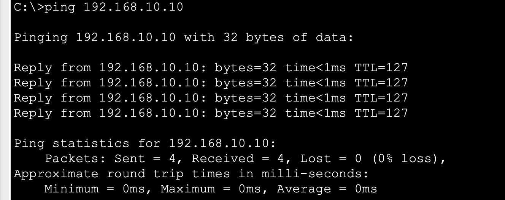

The ping was successful.

### Result

**PASS**

### What this proves

Routing works in both directions.

The network is not merely allowing traffic from VLAN 10 to VLAN 20; VLAN 20 can also reach VLAN 10.

---

# 11. MAC Address Learning Verification

SW1 was checked using:

```cisco
show mac address-table dynamic
```

Evidence:

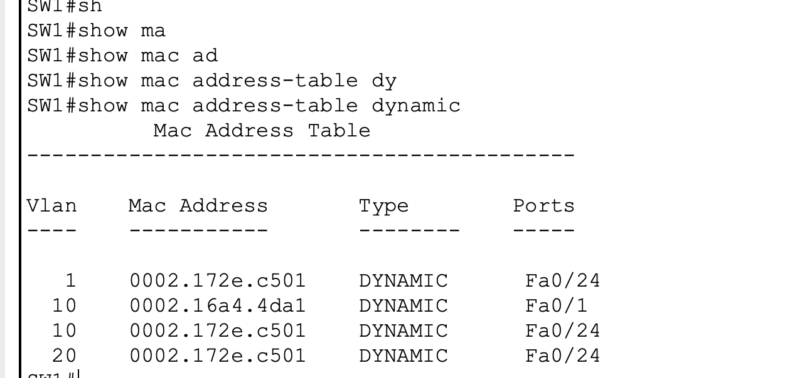

The switch learned MAC addresses associated with the appropriate VLANs and interfaces.

### Result

**PASS**

### What this proves

Layer 2 MAC learning is functioning alongside the Layer 3 routing process.

This is important because inter-VLAN routing does not replace switching.

The packet still has to traverse Layer 2 segments before and after the router performs the Layer 3 forwarding decision.

---

# 12. Trunk Configuration Evidence

The actual trunk configuration was captured from SW1.

Evidence:

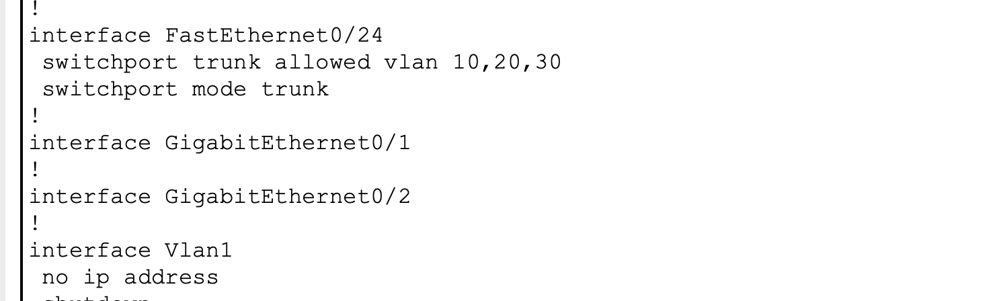

The relevant configuration is:

```cisco
interface FastEthernet0/24
 switchport mode trunk
 switchport trunk allowed vlan 10,20
```

### Result

**PASS**

The configuration matches the intended design.

---

# 13. Troubleshooting Event

During the implementation, the trunk initially failed to become operational.

SW1 reported:

```text
Fa0/24    notconnect    trunk
```

The important distinction was:

```text
Administrative Mode: trunk
Operational Mode: down
```

This demonstrated that the switch was configured to operate as a trunk, but the physical connection was not operational.

R1 was subsequently checked.

The physical interface initially showed:

```text
GigabitEthernet0/0
administratively down
down
```

The interface was enabled with:

```cisco
interface GigabitEthernet0/0
 no shutdown
```

After enabling the interface, the physical link became operational and SW1 subsequently reported the trunk as:

```text
Fa0/24
802.1q
trunking
```

### Troubleshooting lesson

The important lesson was not simply "type `no shutdown`."

The important lesson is to distinguish:

```text
Administrative state
        vs
Operational state
```

A device can be configured correctly while the interface is still operationally unavailable.

---

# 14. Router Verification Commands

The following commands were used during verification:

```cisco
show ip interface brief
```

Used to verify interface and subinterface operational state.

```cisco
show ip route
```

Used to verify that R1 knows the VLAN networks.

```cisco
show running-config | section interface GigabitEthernet0/0
```

Used to verify the Router-on-a-Stick configuration.

---

# 15. Switch Verification Commands

The following commands were used:

```cisco
show vlan brief
```

Used to verify VLAN existence and access-port membership.

```cisco
show interfaces trunk
```

Used to verify trunk operational status, encapsulation, and allowed VLANs.

```cisco
show mac address-table dynamic
```

Used to verify Layer 2 MAC learning.

```cisco
show running-config | section interface FastEthernet0/24
```

Used to verify the trunk configuration.

---

# 16. End-to-End Verification Matrix

| Verification                   | Source        | Destination     | Result |
| ------------------------------ | ------------- | --------------- | ------ |
| VLAN 10 gateway                | PC0           | 192.168.10.1    | PASS   |
| VLAN 20 gateway                | PC1           | 192.168.20.1    | PASS   |
| Same VLAN / local connectivity | VLAN 10       | VLAN 10         | PASS   |
| Inter-VLAN                     | PC0 / VLAN 10 | PC1 / VLAN 20   | PASS   |
| Reverse inter-VLAN             | PC1 / VLAN 20 | PC0 / VLAN 10   | PASS   |
| VLAN 10 route                  | R1            | 192.168.10.0/24 | PASS   |
| VLAN 20 route                  | R1            | 192.168.20.0/24 | PASS   |
| 802.1Q trunk                   | SW1           | Fa0/24          | PASS   |
| MAC learning                   | SW1           | VLAN 10/20      | PASS   |

---

# 17. Final Result

The lab successfully achieved the intended design.

```text
                    R1
             Layer 3 Router
                   │
             G0/0.10 / G0/0.20
                   │
              802.1Q trunk
                   │
                  SW1
              ┌────┴────┐
              │         │
           VLAN 10    VLAN 20
              │         │
             PC0       PC1
```

Final verification established that:

* VLANs are correctly configured.
* Access ports belong to the intended VLANs.
* The switch-to-router link operates as an 802.1Q trunk.
* VLAN 10 and VLAN 20 are transported across the trunk.
* R1 provides a gateway for each VLAN.
* R1 has connected routes to both networks.
* Hosts can reach their respective gateways.
* Hosts in different VLANs can communicate.
* Inter-VLAN communication works in both directions.
* SW1 continues to perform Layer 2 MAC learning.
* The initial interface-state problem was identified and corrected.

## Final Conclusion

**Inter-VLAN routing is operational and verified end-to-end.**

The lab demonstrates the complete transition from isolated Layer 2 broadcast domains to routed Layer 3 communication using Router-on-a-Stick.
