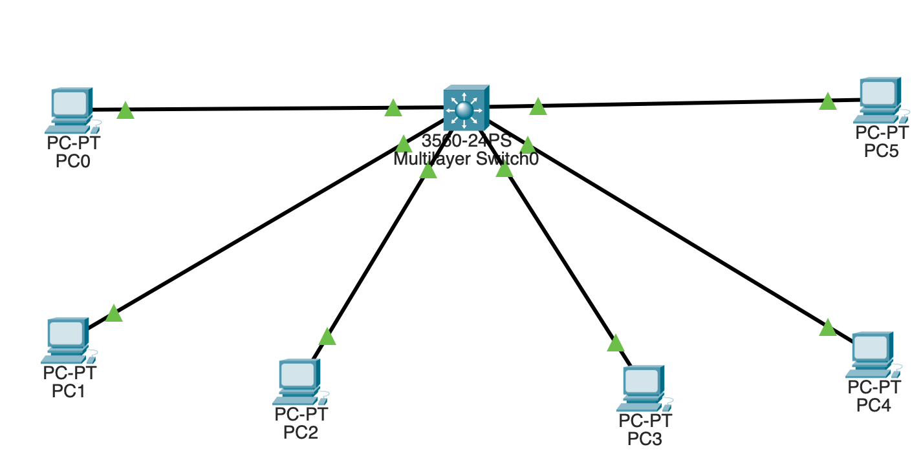
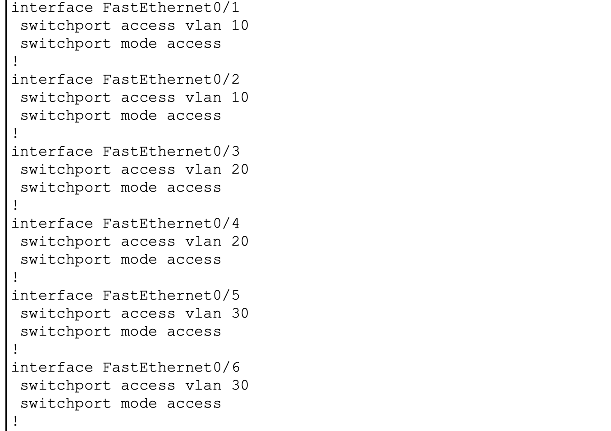
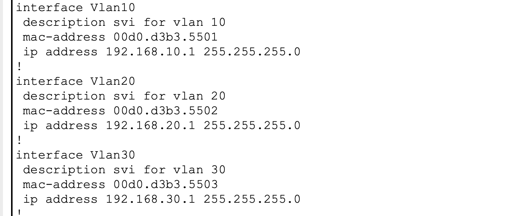
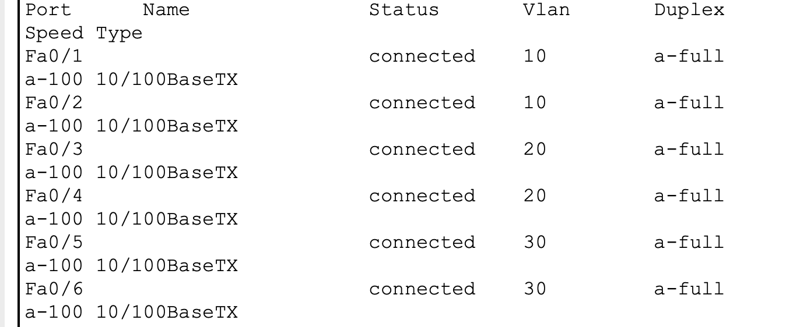
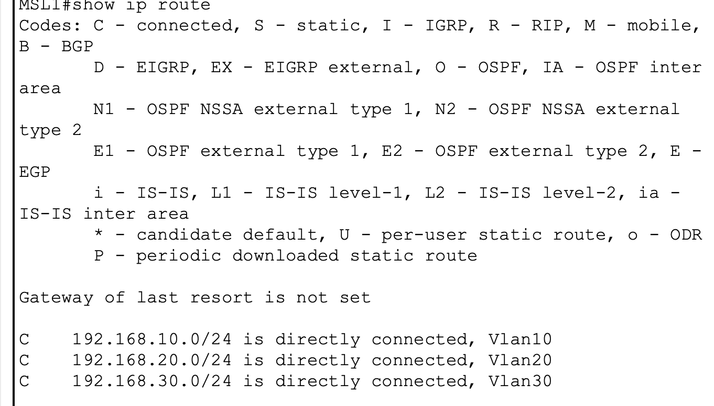
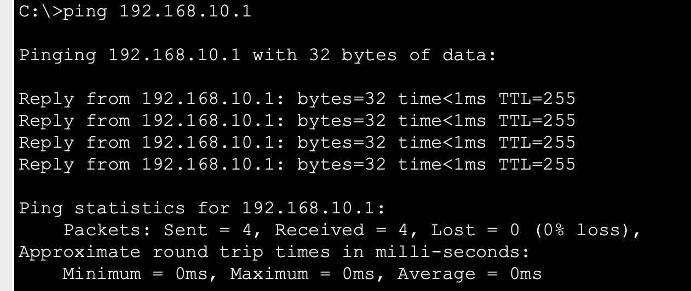
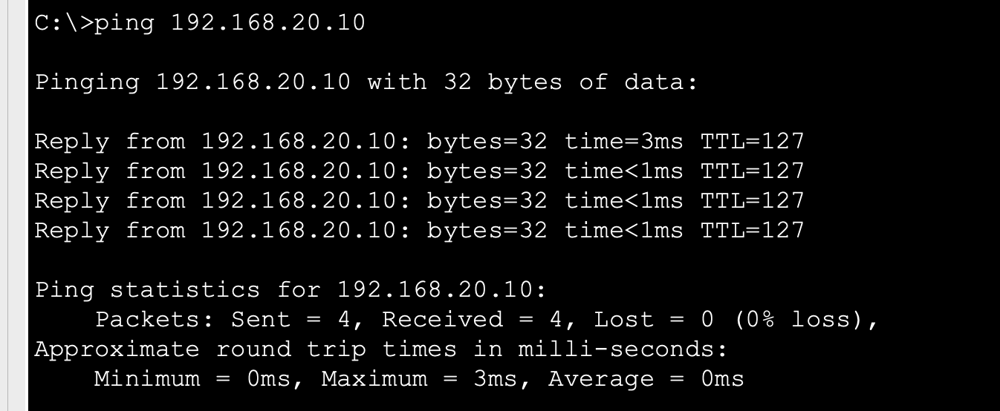
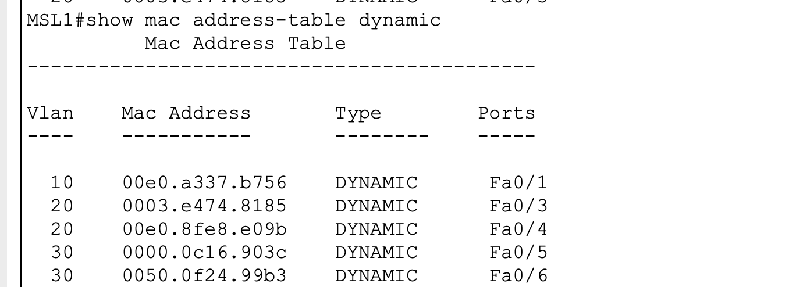

---

# 1. What This Lab Is About

This lab introduces **multilayer switching** and shows how a switch can perform both:

```text
Layer 2 Switching
+
Layer 3 Routing
```

Up to this point, the network devices used in the earlier labs were primarily performing Layer 2 functions.

The previous labs established:

```text
VLANs
↓
Broadcast domains
↓
MAC address learning
↓
Access ports
↓
802.1Q trunking
```

Lab 05 introduced Layer 3 routing using an external router through Router-on-a-Stick.

The architecture was:

```text
Hosts
  ↓
Layer 2 Switch
  ↓
802.1Q Trunk
  ↓
Router
  ↓
Router Subinterfaces
  ↓
Layer 3 Routing
```

This lab introduces another way of solving the same problem.

Instead of sending the traffic to an external router, the routing function is performed directly by the multilayer switch.

The architecture becomes:

```text
Hosts
  ↓
Multilayer Switch
  ↓
SVIs
  ↓
IP Routing
  ↓
Inter-VLAN Communication
```

The main purpose of the lab is therefore to understand how a multilayer switch combines:

```text
Layer 2 switching
+
Layer 3 routing
```

inside one device.

---

# 2. The Problem We Already Understand

A VLAN represents a separate Layer 2 broadcast domain.

For example:

```text
VLAN 10
192.168.10.0/24
```

and:

```text
VLAN 20
192.168.20.0/24
```

are separate networks.

A Layer 2 switch can forward traffic within the same VLAN:

```text
PC0
VLAN 10
   ↓
MLS1
   ↓
PC1
VLAN 10
```

because both endpoints belong to the same broadcast domain.

However:

```text
PC0
VLAN 10
   ↓
MLS1
   X
PC2
VLAN 20
```

cannot communicate through Layer 2 switching alone.

The reason is:

> A Layer 2 switch forwards Ethernet frames within VLANs, but it does not normally route packets between different IP networks.

This is why inter-VLAN communication requires Layer 3 functionality.

---

# 3. The Question That Led to Lab 06

After learning Router-on-a-Stick, the next question was:

> Can inter-VLAN routing be performed without using an external router?

Yes.

The answer is:

```text
Multilayer Switch
```

A multilayer switch is capable of performing both:

```text
Layer 2
```

and:

```text
Layer 3
```

functions.

The device can therefore:

```text
Learn MAC addresses
Create VLANs
Forward Ethernet frames
Perform STP
```

while also:

```text
Assign IP addresses
Maintain a routing table
Use SVIs
Route between IP networks
```

---

# 4. Topology



The topology uses a Cisco 3560 multilayer switch named:

```text
MLS1
```

with multiple endpoint devices distributed across three VLANs.

The logical topology is:

```text
                         MLS1
                ┌────────────────────┐
                │  Cisco 3560        │
                │  Multilayer Switch │
                │                    │
                │   Layer 2 + L3     │
                │                    │
                └──┬──┬──┬──┬──┬──┬─┘
                   │  │  │  │  │  │
                  PC0 PC1 PC2 PC3 PC4 PC5
                   │     │     │     │
                VLAN 10 VLAN 20 VLAN 30
```

The important design change from earlier labs is that **MLS1 itself now performs routing**.

There is no external router required for this local inter-VLAN routing design.

---

# 5. VLAN Design

The final design contains three VLANs:

| VLAN | Name    | IP Network        | Default Gateway |
| ---: | ------- | ----------------- | --------------- |
|   10 | USERS   | `192.168.10.0/24` | `192.168.10.1`  |
|   20 | FINANCE | `192.168.20.0/24` | `192.168.20.1`  |
|   30 | IT      | `192.168.30.0/24` | `192.168.30.1`  |

The VLAN IDs and IP networks were intentionally kept aligned for easier operational identification.

This gives the switch three independent Layer 2 broadcast domains:

```text
VLAN 10 → USERS
VLAN 20 → FINANCE
VLAN 30 → IT
```

---

# 6. Access Port Assignment

The endpoint interfaces were configured as access ports.

```text
Fa0/1 → VLAN 10
Fa0/2 → VLAN 10

Fa0/3 → VLAN 20
Fa0/4 → VLAN 20

Fa0/5 → VLAN 30
Fa0/6 → VLAN 30
```

Evidence:



An access port provides a Layer 2 connection between an endpoint and one VLAN.

For example:

```text
PC0
 ↓
Fa0/1
 ↓
VLAN 10
```

PC0 does not need to understand trunking or VLAN tags.

The switch associates the frame received on Fa0/1 with VLAN 10.

---

# 7. Layer 2 Behavior Before Routing

Before Layer 3 routing was enabled, MLS1 behaved as a normal Layer 2 switch.

Same-VLAN communication worked.

For example:

```text
PC0 ↔ PC1
```

worked because both devices were in:

```text
VLAN 10
192.168.10.0/24
```

Likewise:

```text
PC2 ↔ PC3
```

worked because both devices were in:

```text
VLAN 20
192.168.20.0/24
```

However:

```text
PC0 → PC2
```

failed because:

```text
VLAN 10 ≠ VLAN 20
```

and there was no Layer 3 routing function enabled yet.

This established the Layer 2 baseline before introducing routing.

---

# 8. The New Concept — SVI

The most important new concept in this lab is the:

## Switch Virtual Interface

An SVI is a **logical Layer 3 interface associated with a VLAN**.

Unlike a physical interface such as:

```text
Fa0/1
```

an SVI is logical:

```text
Vlan10
Vlan20
Vlan30
```

The design uses:

```text
VLAN 10
   ↓
SVI VLAN 10
   ↓
192.168.10.1
```

```text
VLAN 20
   ↓
SVI VLAN 20
   ↓
192.168.20.1
```

```text
VLAN 30
   ↓
SVI VLAN 30
   ↓
192.168.30.1
```

Evidence:



These SVI addresses become the default gateways for the endpoints in their respective VLANs.

---

# 9. Why the SVI Becomes the Gateway

Consider PC0:

```text
IP address:
192.168.10.10/24

Gateway:
192.168.10.1
```

The address:

```text
192.168.10.1
```

belongs to:

```text
interface Vlan10
```

on MLS1.

Therefore PC0's gateway is not an external router.

It is the multilayer switch itself.

The relationship is:

```text
PC0
192.168.10.10
      │
      ▼
VLAN 10
      │
      ▼
SVI Vlan10
192.168.10.1
```

The same principle applies to VLAN 20 and VLAN 30.

---

# 10. SVI vs Router Subinterface

This lab should be directly compared with Lab 05.

## Router-on-a-Stick

The router had:

```text
G0/0.10
G0/0.20
```

Each router subinterface was associated with a VLAN.

The architecture was:

```text
Switch
   ↓
802.1Q trunk
   ↓
Router
   ↓
Router subinterface
   ↓
Routing
```

## Multilayer Switch

This lab uses:

```text
Vlan10
Vlan20
Vlan30
```

These are SVIs.

The architecture is:

```text
Endpoint
   ↓
Multilayer Switch
   ↓
SVI
   ↓
Routing
```

The major difference is where the Layer 3 routing function exists.

---

# 11. Creating the SVIs

The three logical Layer 3 interfaces were configured as:

```cisco
interface vlan 10
 ip address 192.168.10.1 255.255.255.0
 no shutdown
```

```cisco
interface vlan 20
 ip address 192.168.20.1 255.255.255.0
 no shutdown
```

```cisco
interface vlan 30
 ip address 192.168.30.1 255.255.255.0
 no shutdown
```

The switch can now represent each VLAN with a Layer 3 interface.

The logical architecture is:

```text
                 MLS1
        ┌────────────────────┐
        │                    │
VLAN 10 ┤ 192.168.10.1       │
        │                    │
VLAN 20 ┤ 192.168.20.1       │
        │                    │
VLAN 30 ┤ 192.168.30.1       │
        │                    │
        └────────────────────┘
```

---

# 12. Enabling Layer 3 Routing

Creating SVIs is only part of the configuration.

The switch must also be enabled to perform Layer 3 routing.

The command is:

```cisco
ip routing
```

Evidence:


This is a global configuration command.

It is not configured under an individual interface.

Its purpose is to enable the switch's routing function.

---

# 13. What `ip routing` Changes

Before routing is enabled:

```text
VLAN 10
   ↓
SVI 10

VLAN 20
   ↓
SVI 20

VLAN 30
   ↓
SVI 30

Routing
   ↓
Disabled
```

The switch has Layer 3 interfaces but is not acting as a router between them.

After:

```cisco
ip routing
```

the switch can perform:

```text
VLAN 10
   ↓
SVI 10
   ↕
Layer 3 Routing
   ↕
SVI 20
   ↓
VLAN 20
```

and similarly for VLAN 30.

This is the key command that activates the Layer 3 behavior of the multilayer switch.

---

# 14. Why `ip routing` Is a Global Command

The command:

```cisco
ip routing
```

applies to the multilayer switch as a whole.

It does not mean:

```text
Enable routing only for VLAN 10
```

or:

```text
Enable routing only for VLAN 20
```

It means:

> Enable the device's Layer 3 routing capability.

That is why it appears at global configuration level.

The configuration evidence captured during the lab shows:

```text
ip routing
```

near the top of the running configuration.

---

# 15. Interface State Verification

After the SVIs were configured, MLS1 was checked using:

```cisco
show ip interface brief
```

Evidence:



The intended result is:

```text
Vlan10    192.168.10.1    up/up
Vlan20    192.168.20.1    up/up
Vlan30    192.168.30.1    up/up
```

The `up/up` condition is important.

An SVI can exist in configuration but still not provide usable Layer 3 connectivity if its operational state is not correct.

---

# 16. Understanding the `up/up` State

For a Layer 3 interface:

```text
Status = up
Protocol = up
```

is the desired operational state.

Conceptually:

```text
up/up
 ↓
Layer 3 interface operational
```

If the SVI were not operational, troubleshooting would need to move backward into the Layer 2 state of the VLAN.

Possible causes could include:

```text
VLAN does not exist
No active member ports
Interface state problem
```

This reinforces the principle that Layer 3 interfaces depend on underlying Layer 2 conditions.

---

# 17. Routing Table Verification

The next verification step was:

```cisco
show ip route
```

Evidence:



The multilayer switch should show connected networks similar to:

```text
C 192.168.10.0/24
C 192.168.20.0/24
C 192.168.30.0/24
```

where:

```text
C = Connected
```

This means MLS1 knows these networks because they are directly attached through its SVIs.

---

# 18. Why the Routes Appear Automatically

No static route was required.

When the switch has:

```text
Vlan10
192.168.10.1/24
```

it automatically knows:

```text
192.168.10.0/24
```

is directly connected.

The same occurs for:

```text
192.168.20.0/24
192.168.30.0/24
```

Therefore the routing table is built from the Layer 3 interfaces already configured on MLS1.

---

# 19. The Routing Table vs the MAC Table

These two tables should never be confused.

## MAC Address Table

Command:

```cisco
show mac address-table dynamic
```

Answers:

> Which MAC address is reachable through which Layer 2 port and VLAN?

This is Layer 2 information.

## Routing Table

Command:

```cisco
show ip route
```

Answers:

> Which Layer 3 network should this packet be forwarded toward?

This is Layer 3 information.

The multilayer switch uses both:

```text
MAC table
   ↓
Layer 2 forwarding

Routing table
   ↓
Layer 3 forwarding
```

---

# 20. Default Gateway Verification

PC0 uses:

```text
192.168.10.1
```

as its default gateway.

PC0 was tested with:

```text
ping 192.168.10.1
```

Evidence:



A successful response demonstrates that:

```text
PC0
 ↓
Fa0/1
 ↓
VLAN 10
 ↓
SVI Vlan10
192.168.10.1
```

is operational.

This is the first Layer 3 hop available to the host.

---

# 21. What Happens When a Host Needs Another Network?

Suppose PC0 wants to communicate with:

```text
192.168.20.10
```

PC0 has:

```text
192.168.10.10/24
```

It therefore determines:

```text
192.168.20.10
```

is outside its local:

```text
192.168.10.0/24
```

network.

PC0 sends the traffic to its default gateway:

```text
192.168.10.1
```

MLS1 receives the packet and performs a routing lookup.

---

# 22. How MLS1 Makes the Routing Decision

The routing table contains:

```text
192.168.10.0/24
        ↓
Vlan10

192.168.20.0/24
        ↓
Vlan20

192.168.30.0/24
        ↓
Vlan30
```

When the destination is:

```text
192.168.20.10
```

MLS1 determines:

```text
Destination network:
192.168.20.0/24

Outgoing Layer 3 interface:
Vlan20
```

The switch then forwards the traffic into VLAN 20.

---

# 23. Inter-VLAN Routing Test

The key connectivity test was:

```text
PC0
192.168.10.10
VLAN 10
        ↓
192.168.20.10
VLAN 20
```

Evidence:



The ping succeeded.

This demonstrates that MLS1 is routing between two different:

```text
VLANs
+
IP networks
+
broadcast domains
```

That is the defining result of the lab.

---

# 24. Packet Path

Conceptually the packet follows:

```text
PC0
192.168.10.10
    │
    ▼
VLAN 10
    │
    ▼
SVI Vlan10
192.168.10.1
    │
    │ Layer 3 routing
    ▼
SVI Vlan20
192.168.20.1
    │
    ▼
VLAN 20
    │
    ▼
Destination host
192.168.20.10
```

This is different from pure Layer 2 switching.

A routing decision is made in the middle of the path.

---

# 25. What Happens at Layer 2 and Layer 3

The multilayer switch performs both kinds of forwarding.

### Layer 2 side

```text
VLAN
MAC address
Ethernet frame
Switching
```

### Layer 3 side

```text
IP address
Routing table
Network selection
Routing
```

The switch therefore works like:

```text
Layer 2
   +
Layer 3
```

rather than being limited to only one layer.

---

# 26. MAC Address Learning

The switch continued learning MAC addresses normally.

Evidence:



This proves that enabling Layer 3 routing does not disable the switch's Layer 2 behavior.

MLS1 still performs:

```text
MAC learning
VLAN switching
```

while also performing:

```text
IP routing
```

This is one of the defining characteristics of a multilayer switch.

---

# 27. Same-VLAN Traffic vs Inter-VLAN Traffic

This distinction is essential.

## Same VLAN

Example:

```text
PC0 → PC1
```

Both are in VLAN 10.

The traffic can remain within Layer 2 switching:

```text
PC0
 ↓
VLAN 10
 ↓
MAC table
 ↓
PC1
```

No routing is needed.

## Different VLAN

Example:

```text
PC0 → PC2
```

The traffic is between:

```text
VLAN 10
192.168.10.0/24
```

and:

```text
VLAN 20
192.168.20.0/24
```

Therefore the traffic must pass through a Layer 3 gateway.

```text
PC0
 ↓
SVI 10
 ↓
Routing table
 ↓
SVI 20
 ↓
PC2
```

---

# 28. Why the Multilayer Switch Can Route Without a Router

This was the major conceptual discovery of the lab.

The switch already has:

```text
Physical interfaces
VLANs
MAC table
```

The multilayer version also provides:

```text
SVIs
IP addresses
Routing table
IP routing
```

Therefore no external router is required for these directly connected VLANs.

The device itself becomes:

```text
Switch
+
Router
```

from a functional perspective.

---

# 29. Comparison With Router-on-a-Stick

The architecture of Router-on-a-Stick was:

```text
PC
 ↓
Layer 2 Switch
 ↓
802.1Q trunk
 ↓
Router
 ↓
Subinterface
 ↓
Routing
```

The architecture here is:

```text
PC
 ↓
Multilayer Switch
 ↓
SVI
 ↓
Routing
```

### Router-on-a-Stick uses:

```text
Router subinterfaces
```

### Multilayer switching uses:

```text
SVIs
```

This is one of the most important differences between the two approaches.

---

# 30. Troubleshooting Method

If inter-VLAN routing does not work, the troubleshooting sequence should be:

```text
1. Check VLANs
       ↓
2. Check access ports
       ↓
3. Check SVI configuration
       ↓
4. Check SVI operational state
       ↓
5. Check ip routing
       ↓
6. Check routing table
       ↓
7. Check host IP address
       ↓
8. Check default gateway
       ↓
9. Test gateway
       ↓
10. Test inter-VLAN connectivity
```

This is better than changing several configurations at the same time.

---

# 31. Common Failure Scenarios

## VLAN exists but SVI is down

Check:

```text
VLAN existence
Active ports
Interface state
```

## SVI is up but inter-VLAN routing fails

Check:

```text
ip routing
Routing table
Default gateway
Host IP configuration
```

## Same VLAN works but different VLAN fails

The Layer 2 switching function is probably working.

The problem is likely somewhere in Layer 3.

---

# 32. Verification Commands Used

## VLAN verification

```cisco
show vlan brief
```

Used to verify VLAN existence and access-port membership.

## Interface verification

```cisco
show ip interface brief
```

Used to verify SVI IP addresses and operational status.

## Routing verification

```cisco
show ip route
```

Used to verify connected Layer 3 networks and routing information.

## Routing enablement verification

```cisco
show running-config | include ip routing
```

Used to verify that Layer 3 routing is enabled.

## MAC verification

```cisco
show mac address-table dynamic
```

Used to verify Layer 2 MAC learning.

## Configuration verification

```cisco
show running-config
```

Used to inspect the actual configuration applied to MLS1.

---

# 33. Evidence Mapping

The screenshot evidence for this lab is organized as:

| Screenshot                         | Evidence                         |
| ---------------------------------- | -------------------------------- |
| `01-toppology.png`                 | Final multilayer switch topology |
| `02-vlan-configuration.png`        | VLAN creation and membership     |
| `03-access-port-configuration.png` | Access-port assignment           |
| `04-svi-configuration.png`         | SVI Layer 3 interfaces           |
| `05-ip-routing-enabled.png`        | Global Layer 3 routing enabled   |
| `06-interface-status.png`          | SVI operational state            |
| `07-routing-table.png`             | Connected Layer 3 networks       |
| `08-pc0-gateway-ping.png`          | PC0 reaching its default gateway |
| `09-inter-vlan-routing.png`        | Successful VLAN-to-VLAN routing  |
| `10-mac-address-table.png`         | Layer 2 MAC learning             |

This creates a complete evidence chain from configuration to end-to-end connectivity.

---

# 34. Interview-Level Questions

### What is a multilayer switch?

A multilayer switch is a switch capable of performing both Layer 2 switching and Layer 3 routing.

### What is an SVI?

An SVI is a logical Layer 3 interface associated with a VLAN.

### What is the purpose of an SVI?

It provides a Layer 3 gateway for hosts in its VLAN.

### Why is `ip routing` required?

It enables the multilayer switch to perform Layer 3 routing between its Layer 3 interfaces.

### Why does the routing table contain connected routes?

Because the VLAN networks are directly connected through their SVIs.

### What is the difference between an SVI and a router subinterface?

An SVI is a logical interface on a multilayer switch; a router subinterface is a logical interface on an external router.

### Why can same-VLAN hosts communicate without routing?

Because they belong to the same Layer 2 broadcast domain and can use MAC-based switching.

### Why does inter-VLAN communication require routing?

Because each VLAN represents a different Layer 2 broadcast domain and normally a different IP network.

### Why does a multilayer switch not need an external router here?

Because the switch itself provides the VLAN gateways and performs the routing function.

---

# 35. Final Mental Model

The complete process can be remembered as:

```text
VLAN
   ↓
Layer 2 broadcast domain
   ↓
SVI
   ↓
Default gateway
   ↓
ip routing
   ↓
Routing table
   ↓
Layer 3 forwarding
   ↓
Destination VLAN
   ↓
Layer 2 forwarding
   ↓
Destination host
```

For same-VLAN traffic:

```text
Host
 ↓
VLAN
 ↓
MAC table
 ↓
Destination host
```

For inter-VLAN traffic:

```text
Host
 ↓
Default gateway
 ↓
SVI
 ↓
Routing table
 ↓
Destination SVI
 ↓
Destination VLAN
 ↓
Host
```

---

# 36. Lab Progression

The learning progression now looks like:

```text
Lab 03
VLAN Segmentation
        ↓
Separate broadcast domains

Lab 04
VLAN Trunking
        ↓
Transport multiple VLANs

Lab 05
Router-on-a-Stick
        ↓
External Layer 3 routing

Lab 06
Multilayer Switch
        ↓
SVIs + ip routing
        ↓
Integrated Layer 2 + Layer 3
```

Each lab builds on the previous one.

---

# 37. Final Understanding

The key realization from this lab is:

> A switch is not automatically limited to Layer 2.

A traditional Layer 2 switch primarily performs:

```text
VLANs
MAC learning
Ethernet switching
```

A multilayer switch can perform:

```text
VLANs
MAC learning
Ethernet switching
+
SVIs
IP addressing
Routing
```

The multilayer switch therefore provides both:

```text
Layer 2 segmentation
```

and:

```text
Layer 3 communication
```

within the same device.

---

# 38. Final Takeaway

The most important commands from this lab are:

```cisco
interface vlan 10
ip address 192.168.10.1 255.255.255.0

interface vlan 20
ip address 192.168.20.1 255.255.255.0

interface vlan 30
ip address 192.168.30.1 255.255.255.0

ip routing
```

But the commands themselves are not the main lesson.

The real lesson is:

```text
VLAN
   ↓
Segmentation

SVI
   ↓
Gateway

ip routing
   ↓
Routing capability

Routing table
   ↓
Forwarding decision
```

Lab 06 therefore establishes the foundation for more advanced Layer 3 networking topics such as:

* Static routing
* Default routes
* Dynamic routing
* OSPF
* EIGRP
* Layer 3 campus design
* Routing protocol convergence
* Route selection
