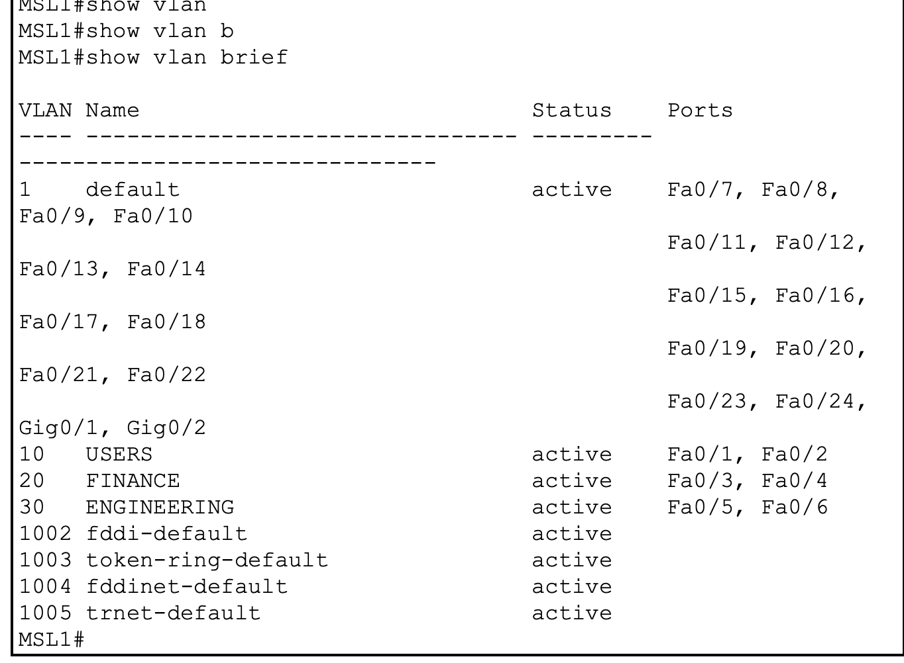

# Lab 06 — Multilayer Switch Inter-VLAN Routing

## Verification Results

---

# 1. Verification Overview

This document records the verification and validation performed after configuring `MLS1` as a multilayer switch capable of Layer 2 switching and Layer 3 routing.

The lab was designed to prove that:

```text
Layer 2 Switching
        +
VLAN Segmentation
        +
SVIs
        +
IP Routing
        ↓
Inter-VLAN Communication
```

The verification process was performed progressively rather than relying on a single connectivity test.

The following areas were verified:

* VLAN creation
* VLAN membership
* Access-port assignment
* SVI configuration
* Layer 3 routing enablement
* SVI operational state
* Routing table
* Default gateway reachability
* Same-VLAN communication
* Inter-VLAN communication
* MAC address learning

---

# 2. Device Under Test

| Item            | Value                        |
| --------------- | ---------------------------- |
| Device          | `MLS1`                       |
| Platform        | Cisco 3560 Multilayer Switch |
| Role            | Layer 2 + Layer 3            |
| Routing model   | SVI-based inter-VLAN routing |
| Number of VLANs | 3                            |
| Number of SVIs  | 3                            |
| Routing enabled | Yes                          |

The multilayer switch is the central device responsible for both switching and routing in this topology.

---

# 3. Final VLAN Design

The final VLAN design is:

| VLAN | Name    | IP Network        | Default Gateway |
| ---: | ------- | ----------------- | --------------- |
|   10 | USERS   | `192.168.10.0/24` | `192.168.10.1`  |
|   20 | FINANCE | `192.168.20.0/24` | `192.168.20.1`  |
|   30 | IT      | `192.168.30.0/24` | `192.168.30.1`  |

Each VLAN represents a separate Layer 2 broadcast domain.

The associated Layer 3 gateway is provided by an SVI on `MLS1`.

---

# 4. Final Access-Port Design

The access-port assignments are:

| Interface | Endpoint | VLAN | Department |
| --------- | -------- | ---: | ---------- |
| Fa0/1     | PC0      |   10 | USERS      |
| Fa0/2     | PC1      |   10 | USERS      |
| Fa0/3     | PC2      |   20 | FINANCE    |
| Fa0/4     | PC3      |   20 | FINANCE    |
| Fa0/5     | PC4      |   30 | IT         |
| Fa0/6     | PC5      |   30 | IT         |

This ensures that each endpoint enters the correct Layer 2 broadcast domain.

---

# 5. Endpoint Addressing

The endpoint configuration is:

| Device | VLAN | IP Address      | Mask  | Default Gateway |
| ------ | ---: | --------------- | ----- | --------------- |
| PC0    |   10 | `192.168.10.10` | `/24` | `192.168.10.1`  |
| PC1    |   10 | `192.168.10.11` | `/24` | `192.168.10.1`  |
| PC2    |   20 | `192.168.20.10` | `/24` | `192.168.20.1`  |
| PC3    |   20 | `192.168.20.11` | `/24` | `192.168.20.1`  |
| PC4    |   30 | `192.168.30.10` | `/24` | `192.168.30.1`  |
| PC5    |   30 | `192.168.30.11` | `/24` | `192.168.30.1`  |

The default gateway for each host is the SVI belonging to that host's VLAN.

---

# 6. Topology Verification


The physical topology was verified to ensure that all endpoint devices were connected to the intended switch interfaces.

The logical design contains:

```text
                 MLS1
        ┌─────────┼─────────┐
        │         │         │
      VLAN 10   VLAN 20   VLAN 30
        │         │         │
     USERS     FINANCE      IT
```

### Result

**PASS**

The topology matches the intended multilayer-switch design.

---

# 7. VLAN Configuration Verification

Command used:

```cisco
show vlan brief
```

Evidence:



The output was expected to confirm:

```text
VLAN 10 → USERS
VLAN 20 → FINANCE
VLAN 30 → IT
```

with the endpoint interfaces assigned appropriately.

### Result

**PASS**

All three VLANs exist and are active.

The expected access-port relationships are present.

### What this proves

The Layer 2 segmentation foundation is correct.

MLS1 has three separate broadcast domains before Layer 3 routing is considered.

---

# 8. Access-Port Verification

Evidence:


The endpoint-facing interfaces were configured as access ports.

Expected mapping:

```text
Fa0/1 → VLAN 10
Fa0/2 → VLAN 10
Fa0/3 → VLAN 20
Fa0/4 → VLAN 20
Fa0/5 → VLAN 30
Fa0/6 → VLAN 30
```

### Result

**PASS**

Each endpoint-facing port belongs to the correct VLAN.

### What this proves

The switch is correctly placing endpoint traffic into the intended Layer 2 broadcast domains.

---

# 9. SVI Configuration Verification

Evidence:


The multilayer switch was configured with three SVIs:

```text
Vlan10 → 192.168.10.1/24
Vlan20 → 192.168.20.1/24
Vlan30 → 192.168.30.1/24
```

The expected logical structure is:

```text
VLAN 10
   ↓
SVI Vlan10
   ↓
192.168.10.1
```

```text
VLAN 20
   ↓
SVI Vlan20
   ↓
192.168.20.1
```

```text
VLAN 30
   ↓
SVI Vlan30
   ↓
192.168.30.1
```

### Result

**PASS**

All three routed VLANs have Layer 3 gateway interfaces.

### What this proves

Each VLAN has a Layer 3 entry point through which hosts can reach destinations outside their local subnet.

---

# 10. IP Routing Enablement Verification

Evidence:


The configuration contains:

```cisco
ip routing
```

### Result

**PASS**

Layer 3 routing is enabled globally on MLS1.

### Why this matters

The SVIs provide Layer 3 interfaces.

The `ip routing` command enables MLS1 to actually route packets between those Layer 3 interfaces.

The relationship is:

```text
SVIs
   ↓
Layer 3 interfaces
   ↓
ip routing
   ↓
Inter-VLAN routing capability
```

---

# 11. SVI Operational State Verification

Command used:

```cisco
show ip interface brief
```

Evidence:


The expected operational state is:

```text
Vlan10    192.168.10.1    up    up
Vlan20    192.168.20.1    up    up
Vlan30    192.168.30.1    up    up
```

### Result

**PASS**

The configured SVIs are operational.

### What this proves

The Layer 3 gateway interfaces are not merely present in configuration; they are active and usable.

---

# 12. Routing Table Verification

Command used:

```cisco
show ip route
```

Evidence:


The routing table is expected to contain:

```text
C 192.168.10.0/24
C 192.168.20.0/24
C 192.168.30.0/24
```

where:

```text
C = Connected
```

### Result

**PASS**

MLS1 has direct Layer 3 knowledge of all three VLAN networks.

### What this proves

The multilayer switch can identify the destination network and determine the correct SVI for directly connected VLAN networks.

No static route is required for these local networks.

---

# 13. Gateway Reachability Verification — VLAN 10

PC0 belongs to VLAN 10:

```text
IP address:
192.168.10.10/24
```

Default gateway:

```text
192.168.10.1
```

Test:

```text
ping 192.168.10.1
```

Evidence:


### Result

**PASS**

PC0 successfully reached its default gateway.

### What this proves

The following path is operational:

```text
PC0
  ↓
Fa0/1
  ↓
VLAN 10
  ↓
SVI Vlan10
192.168.10.1
```

This is the first Layer 3 hop for traffic leaving VLAN 10.

---

# 14. Inter-VLAN Routing Verification

The primary Layer 3 test was performed from a host in VLAN 10 to a host in VLAN 20.

Source:

```text
PC0
192.168.10.10
VLAN 10
```

Destination:

```text
PC2
192.168.20.10
VLAN 20
```

Test:

```text
ping 192.168.20.10
```

Evidence:


### Result

**PASS**

The ping succeeded.

### Why this is significant

The source and destination are separated by:

```text
Different VLANs
Different broadcast domains
Different IP networks
```

The traffic therefore cannot remain entirely within Layer 2 switching.

MLS1 must perform a Layer 3 routing decision.

This successful test proves that:

```text
VLAN 10
   ↓
SVI Vlan10
   ↓
Routing table
   ↓
SVI Vlan20
   ↓
VLAN 20
```

is operational.

---

# 15. Reverse Inter-VLAN Verification

The reverse direction was also tested during the lab.

Source:

```text
PC2
192.168.20.10
VLAN 20
```

Destination:

```text
PC0
192.168.10.10
VLAN 10
```

The reverse test succeeded.

### Result

**PASS**

This demonstrates that routing is functioning in both directions.

The result is not dependent on one specific traffic direction.

---

# 16. Same-VLAN Verification

Same-VLAN communication was also confirmed before and after Layer 3 routing was enabled.

## VLAN 10

```text
PC0 → PC1
```

Expected and observed:

**PASS**

Both hosts are in:

```text
VLAN 10
192.168.10.0/24
```

## VLAN 20

```text
PC2 → PC3
```

Expected and observed:

**PASS**

Both hosts are in:

```text
VLAN 20
192.168.20.0/24
```

This demonstrates that enabling Layer 3 routing does not remove normal Layer 2 switching.

---

# 17. MAC Address Learning Verification

Command used:

```cisco
show mac address-table dynamic
```

Evidence:


The switch dynamically learns endpoint MAC addresses.

### Result

**PASS**

MAC learning is operational.

### What this proves

MLS1 continues performing Layer 2 switching even after Layer 3 routing has been enabled.

The device is therefore performing both:

```text
Layer 2
MAC learning + VLAN switching
```

and:

```text
Layer 3
IP routing
```

---

# 18. Layer 2 Verification Summary

The Layer 2 portion of the design was verified as follows:

| Verification           | Result |
| ---------------------- | ------ |
| VLAN 10 exists         | PASS   |
| VLAN 20 exists         | PASS   |
| VLAN 30 exists         | PASS   |
| Fa0/1 in VLAN 10       | PASS   |
| Fa0/2 in VLAN 10       | PASS   |
| Fa0/3 in VLAN 20       | PASS   |
| Fa0/4 in VLAN 20       | PASS   |
| Fa0/5 in VLAN 30       | PASS   |
| Fa0/6 in VLAN 30       | PASS   |
| Same-VLAN connectivity | PASS   |
| MAC address learning   | PASS   |

---

# 19. Layer 3 Verification Summary

The Layer 3 portion of the design was verified as follows:

| Verification               | Result |
| -------------------------- | ------ |
| SVI Vlan10 configured      | PASS   |
| SVI Vlan20 configured      | PASS   |
| SVI Vlan30 configured      | PASS   |
| `ip routing` enabled       | PASS   |
| Vlan10 up/up               | PASS   |
| Vlan20 up/up               | PASS   |
| Vlan30 up/up               | PASS   |
| Route to 192.168.10.0/24   | PASS   |
| Route to 192.168.20.0/24   | PASS   |
| Route to 192.168.30.0/24   | PASS   |
| PC0 → VLAN 10 gateway      | PASS   |
| Inter-VLAN routing         | PASS   |
| Reverse inter-VLAN routing | PASS   |

---

# 20. End-to-End Verification Matrix

| Source | Destination  | Relationship      | Expected | Actual |
| ------ | ------------ | ----------------- | -------- | ------ |
| PC0    | PC1          | Same VLAN 10      | Success  | PASS   |
| PC2    | PC3          | Same VLAN 20      | Success  | PASS   |
| PC4    | PC5          | Same VLAN 30      | Success  | PASS   |
| PC0    | 192.168.10.1 | Local gateway     | Success  | PASS   |
| PC0    | PC2          | VLAN 10 → VLAN 20 | Success  | PASS   |
| PC2    | PC0          | VLAN 20 → VLAN 10 | Success  | PASS   |

The results demonstrate both Layer 2 switching and Layer 3 routing functionality.

---

# 21. Packet Path — Same VLAN

For:

```text
PC0 → PC1
```

the traffic remains within VLAN 10.

Conceptually:

```text
PC0
192.168.10.10
    ↓
Fa0/1
    ↓
VLAN 10
    ↓
MAC address lookup
    ↓
Fa0/2
    ↓
PC1
192.168.10.11
```

No Layer 3 routing is required.

---

# 22. Packet Path — Inter-VLAN

For:

```text
PC0 → PC2
```

the traffic crosses from VLAN 10 to VLAN 20.

Conceptually:

```text
PC0
192.168.10.10
    ↓
VLAN 10
    ↓
Default Gateway
192.168.10.1
    ↓
SVI Vlan10
    ↓
Routing Table
    ↓
SVI Vlan20
192.168.20.1
    ↓
VLAN 20
    ↓
PC2
192.168.20.10
```

This is the core forwarding process demonstrated by the lab.

---

# 23. Layer 2 vs Layer 3 Evidence

The lab provides two distinct categories of evidence.

## Layer 2 Evidence

```text
show vlan brief
show mac address-table dynamic
```

These prove:

```text
VLAN segmentation
MAC learning
Access-port membership
Layer 2 switching
```

## Layer 3 Evidence

```text
show ip interface brief
show ip route
show running-config | include ip routing
```

These prove:

```text
SVIs
IP addressing
Routing capability
Connected networks
Layer 3 forwarding
```

The two categories together demonstrate why MLS1 is a **multilayer** switch.

---

# 24. Important Configuration Relationships

The configuration can be reduced to four dependencies:

```text
VLAN
  ↓
SVI
  ↓
Default Gateway
  ↓
ip routing
```

More completely:

```text
VLAN
   ↓
Access-port membership
   ↓
SVI
   ↓
Gateway IP
   ↓
ip routing
   ↓
Routing table
   ↓
Inter-VLAN forwarding
```

If any required component is missing, inter-VLAN communication may fail.

---

# 25. Troubleshooting Sequence

The troubleshooting approach used for this topology is:

```text
1. Verify physical connectivity
        ↓
2. Verify VLAN existence
        ↓
3. Verify access-port membership
        ↓
4. Verify SVI configuration
        ↓
5. Verify SVI state
        ↓
6. Verify ip routing
        ↓
7. Verify routing table
        ↓
8. Verify host IP configuration
        ↓
9. Verify default gateway
        ↓
10. Test gateway reachability
        ↓
11. Test inter-VLAN routing
```

This follows the network from the lower layers toward the higher layers.

---

# 26. Common Failure Scenarios

## VLAN missing

If a VLAN does not exist, the corresponding access ports cannot operate as intended.

Check:

```cisco
show vlan brief
```

---

## Wrong access VLAN

If an endpoint is placed in the wrong VLAN, connectivity will not match the intended design.

Check:

```cisco
show vlan brief
```

and:

```cisco
show running-config
```

---

## SVI missing

If the VLAN has no SVI, the VLAN has no Layer 3 gateway on MLS1.

Check:

```cisco
show ip interface brief
```

---

## SVI down

If an SVI is down, investigate the associated VLAN and underlying Layer 2 state.

Check:

```cisco
show vlan brief
show ip interface brief
```

---

## `ip routing` disabled

The switch may have SVIs and IP addresses but still fail to route between them.

Check:

```cisco
show running-config | include ip routing
```

---

## Missing route

Check:

```cisco
show ip route
```

The destination network should appear in the routing table.

---

## Wrong default gateway

A host may communicate within its local subnet but fail when trying to reach another network.

Verify that the host gateway matches the SVI for its VLAN.

---

# 27. Verification of the Three Routing Domains

The lab includes three routed VLANs:

```text
VLAN 10
192.168.10.0/24
Gateway 192.168.10.1
```

```text
VLAN 20
192.168.20.0/24
Gateway 192.168.20.1
```

```text
VLAN 30
192.168.30.0/24
Gateway 192.168.30.1
```

This means MLS1 has three Layer 3 interfaces and can make routing decisions between the three networks.

Conceptually:

```text
                  MLS1
          ┌──────────────────┐
          │                  │
          │   IP Routing     │
          │        ↕         │
          │ SVI10 SVI20 SVI30│
          └────┬────┬────┬───┘
               │    │    │
             VLAN10 VLAN20 VLAN30
```

---

# 28. Why the Lab Is Different From Router-on-a-Stick

Lab 05 used an external router:

```text
Switch
   ↓
802.1Q trunk
   ↓
Router
   ↓
Router subinterfaces
   ↓
Routing
```

Lab 06 uses:

```text
Multilayer Switch
   ↓
SVIs
   ↓
Routing
```

Therefore the routing function has moved from a separate router into MLS1.

This is the main architectural change demonstrated by this lab.

---

# 29. Verification Command Reference

### VLANs

```cisco
show vlan brief
```

Purpose:

Verify VLAN creation and access-port membership.

### SVI state

```cisco
show ip interface brief
```

Purpose:

Verify SVI addressing and operational status.

### Routing table

```cisco
show ip route
```

Purpose:

Verify Layer 3 network knowledge and forwarding paths.

### Routing enablement

```cisco
show running-config | include ip routing
```

Purpose:

Verify that Layer 3 routing is enabled.

### SVI configuration

```cisco
show running-config | section interface Vlan
```

Purpose:

Verify SVI configuration.

### MAC learning

```cisco
show mac address-table dynamic
```

Purpose:

Verify Layer 2 MAC learning.

### Full configuration

```cisco
show running-config
```

Purpose:

Inspect the actual configuration applied to MLS1.

---

# 30. Evidence Mapping

The captured evidence is organized as:

| Screenshot                         | What It Proves                      |
| ---------------------------------- | ----------------------------------- |
| `01-toppology.png`                 | Physical and logical topology       |
| `02-vlan-configuration.png`        | VLAN creation and membership        |
| `03-access-port-configuration.png` | Access-port assignments             |
| `04-svi-configuration.png`         | SVI creation and gateway addressing |
| `05-ip-routing-enabled.png`        | Layer 3 routing enabled             |
| `06-interface-status.png`          | SVI operational state               |
| `07-routing-table.png`             | Connected Layer 3 networks          |
| `08-pc0-gateway-ping.png`          | VLAN 10 gateway reachability        |
| `09-inter-vlan-routing.png`        | Successful inter-VLAN routing       |
| `10-mac-address-table.png`         | Layer 2 MAC learning                |

Together, these screenshots provide a complete configuration-to-verification evidence chain.

---

# 31. Final Verification Checklist

## Layer 2

* [x] VLAN 10 exists
* [x] VLAN 20 exists
* [x] VLAN 30 exists
* [x] Access ports assigned correctly
* [x] Same-VLAN connectivity works
* [x] MAC addresses are learned dynamically

## Layer 3

* [x] SVI Vlan10 configured
* [x] SVI Vlan20 configured
* [x] SVI Vlan30 configured
* [x] Gateway addresses assigned
* [x] `ip routing` enabled
* [x] SVIs operational
* [x] Connected routes present
* [x] Gateway connectivity works
* [x] Inter-VLAN routing works
* [x] Reverse inter-VLAN routing works

---

# 32. Final Result

**LAB 06 — PASSED**

The multilayer switch successfully performs both Layer 2 switching and Layer 3 routing.

The final verified architecture is:

```text
                     MLS1
          ┌────────────────────────┐
          │  Layer 2 Switching     │
          │          +             │
          │   Layer 3 Routing      │
          │                        │
          │ SVI10 → 192.168.10.1  │
          │ SVI20 → 192.168.20.1  │
          │ SVI30 → 192.168.30.1  │
          │                        │
          │      ip routing        │
          └────────────────────────┘
              │       │       │
            VLAN10  VLAN20  VLAN30
```

The verification proves that:

```text
VLAN segmentation
        +
SVI gateways
        +
IP routing
        +
Routing table
        ↓
Successful inter-VLAN communication
```

---

# 33. Final Learning Outcome

The most important outcome of the verification is that the same switch is performing two fundamentally different forwarding functions.

For same-VLAN traffic:

```text
Host
 ↓
VLAN
 ↓
MAC table
 ↓
Destination host
```

For inter-VLAN traffic:

```text
Host
 ↓
Default gateway
 ↓
SVI
 ↓
Routing table
 ↓
Destination SVI
 ↓
Destination VLAN
 ↓
Destination host
```

This is the practical meaning of **multilayer switching**.

---

# 34. Final Conclusion

Lab 06 successfully demonstrated the transition from a Layer 2-only switching architecture to a multilayer switching architecture.

The VLANs remain separate Layer 2 broadcast domains, but the SVIs provide Layer 3 gateways and `ip routing` allows MLS1 to route traffic between the associated IP networks.

The combination of:

```text
VLANs
+
Access Ports
+
SVIs
+
ip routing
+
Routing Table
+
Successful Gateway Tests
+
Successful Inter-VLAN Tests
+
MAC Learning
```

provides complete end-to-end evidence that the multilayer switch is functioning as intended.

> **Key takeaway:** A multilayer switch can preserve VLAN-based Layer 2 segmentation while simultaneously providing Layer 3 routing between those VLANs through SVIs.
